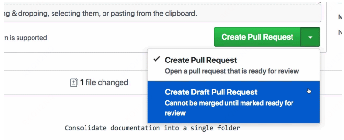

# How to contribute

Development happens on [GitHub](https://github.com/ccfos/huatuo) and contributions in all forms are welcome. Please take a look at the architecture to get a better understanding of the high-level goals.

## Clone and Provision Environment

1. Make sure you have a GitHub account.

2. Fork the [huatuo](https://github.com/ccfos/huatuo) repository to your GitHub user or organization.

3. Turn off GitHub actions for your fork as described in the [GitHub Docs](https://docs.github.com/en/repositories/managing-your-repositorys-settings-and-features/enabling-features-for-your-repository/managing-github-actions-settings-for-a-repository#managing-github-actions-permissions-for-your-repository). This is recommended to avoid unnecessary CI notification failures on the fork.

4. Clone your ${YOUR_GITHUB_USERNAME_OR_ORG}/huatuo fork and set up the base repository as upstream remote:

    ```
    git clone https://github.com/${YOUR_GITHUB_USERNAME_OR_ORG}/huatuo.git
    cd huatuo
    git remote add upstream https://github.com/ccfos/huatuo.git
    ```

5. Set up your Development Setup.

6. Check the [GitHub issues](https://github.com/ccfos/huatuo/issues) for good tasks to get started.

## Developer Certificate of Origin

The HUATUO project requires that all contributions to project repositories carry the Developer Certificate of Origin. This is as simple as appending a footer to your commits, a standard commit message is as follows:

```
fix: resolve authentication bug

The login token was not being validated properly.

Closes #123

Signed-off-by: Your Name <name@example.org>
```

Signing off your contributions this way means that you've read and understood the contents of the DCO.


## Running the tests

Many of the tests require privileges to set resource limits and load eBPF code. The easiest way to obtain these is to run the tests with sudo. Run all tests with the following command:

```
make all
go test ./...
```

To test the current package with Go linters.

```
make check
```

## Submitting a pull request

1. Open a draft pull request. GitHub provides the ability to create a Pull Request in “draft” mode. On the “New Pull Request” page, below the pull request description box there is a button for creating the pull request. Click the arrow and choose “Create draft pull request”. If your PR is still a work in progress, please select this mode. You will still be able to run the CI against it.

    

2. To notify reviewers that the PR is ready for review, click **Ready for review** at the bottom of the page.

3. Engage in any discussions raised by reviewers and address any changes requested. Set the PR to draft PR mode while you address changes, then click **Ready for review** to re-request review.
