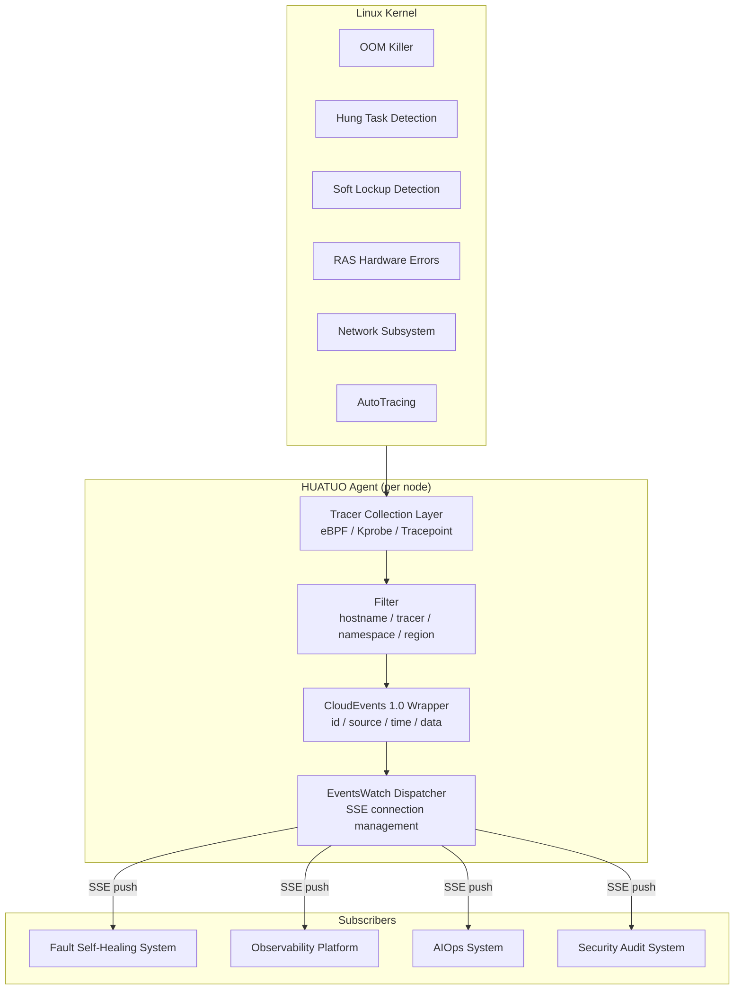
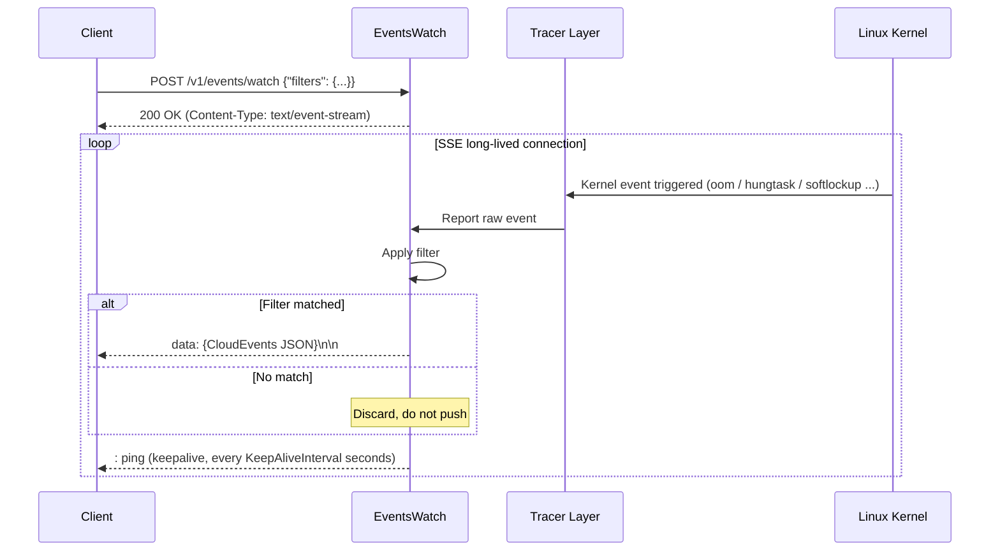
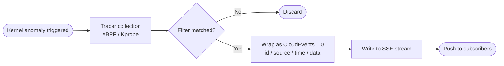

{}
<div style="text-align: center;">
HUATUO is an operating system observability project open-sourced by DiDi and incubated under CCF (China Computer Federation). It provides kernel-level deep observability for cloud-native general computing, AI computing, cloud services, and foundational services.
</div>
{}

## 📖 Overview

`/v1/events/watch` is HUATUO's real-time kernel event subscription endpoint. A single HTTP POST long-lived connection streams kernel anomaly events from the node continuously. Events are wrapped in the [CloudEvents 1.0](https://cloudevents.io/) specification and delivered via the [Server-Sent Events (SSE)](https://html.spec.whatwg.org/multipage/server-sent-events.html) protocol.

---

## 🎯 Use Cases

Kernel event subscription surfaces OS-level anomaly signals directly to higher-level systems, eliminating the latency and overhead of traditional polling. The following are typical integration scenarios.

### Fault Self-Healing

Kernel events are the primary signal source for self-healing decisions. After subscribing to `events/watch`, a healing controller can trigger remediation the moment an event occurs, without waiting for an alert to propagate through a monitoring pipeline:

- **OOM self-healing**: On receiving an `oom` event, immediately scale, restart, or drain traffic from the triggering container. Reduces service interruption from minutes to seconds.
- **Hung task self-healing**: On receiving a `hungtask` event, automatically cordon the node and evict Pods to prevent cascading blockage from spreading across the cluster.
- **Network fault self-healing**: On receiving a `netdev_txqueue_timeout` or `netdev_bonding_lacp` event, trigger a NIC reset or traffic failover to restore the network link within minutes.
- **I/O storm self-healing**: On receiving an `iotracing` event, dynamically throttle the affected container's disk I/O quota via cgroup blkio to protect co-located services on the same node.

### Observability Platforms

Integrating HUATUO kernel events into an observability platform adds a kernel-level perspective beyond application metrics and logs:

- **Event timeline correlation**: Overlay `softlockup`, `oom`, and other kernel events onto Grafana timelines, aligning them precisely with application error rates and latency curves for root-cause analysis.
- **Anomaly-driven alerting**: Replace fixed-threshold alerts with kernel events to reduce false positives. For example, a `ras` hardware error event triggers a high-priority alert directly, without relying on a CPU error rate crossing a threshold.
- **Capacity and stability analysis**: Subscribe to `memburst`, `dload`, and other AutoTracing events over time to establish a node stability baseline and provide kernel-level data for capacity planning.
- **Multi-dimensional drill-down**: Events carry container ID, namespace, region, and other context fields. Alert links can drill down directly to the corresponding Pod, Node, or Region view.

### Security Auditing and Compliance

- **Anomalous behavior detection**: A cluster of `oom`, `hungtask`, or `softlockup` events outside business peak hours may indicate resource abuse or a malicious workload, triggering a security review workflow.
- **Event retention and traceability**: Write the CloudEvents stream to a message queue (Kafka, Pulsar) or object storage to satisfy the event retention requirements of security compliance frameworks.

### Chaos Engineering and Load Testing

- **Fault injection verification**: After injecting network latency or memory pressure via a chaos engineering platform, subscribe to `net_rx_latency` and `memburst` events in real time to verify the fault is active, replacing manual observation.
- **Load test baseline**: Subscribe to all events during a load test. The timestamp of the first kernel anomaly event precisely marks the system's stress threshold.

### AIOps

- **Event-driven root-cause analysis**: Feed kernel events as features into AI/ML models alongside application metrics for multi-dimensional root-cause inference, reducing manual investigation time.
- **Predictive maintenance**: Model `ras` hardware errors and `netdev_bonding_lacp` hardware-layer events to detect anomalies before a device fails completely, triggering proactive migration.
- **Intelligent suppression and aggregation**: Automatically aggregate similar events within the same time window to avoid alert storms. Deliver a concise root-cause summary to on-call engineers.

---

## 💎 Value

| Dimension | Traditional Approach | With HUATUO events/watch |
|---|---|---|
| Timeliness | Alert trigger latency: 1–5 minutes | Real-time kernel event push; latency < 1 s |
| Signal accuracy | Metric threshold-based; high false-positive rate | Events originate from kernel decisions; false-positive rate near zero |
| Context richness | Limited metric dimensions | Full context: container, node, region, and more |
| Integration cost | Requires custom eBPF collection or a third-party agent | Single HTTP POST to subscribe; standard CloudEvents format |
| Protocol compatibility | Vendor-specific formats | Follows CloudEvents 1.0; compatible with any conformant platform |

---

## 🚀 Usage

### 1. CloudEvents Specification

#### 1.1 CloudEvents 1.0 Envelope Fields

Each pushed event is a JSON object conforming to the CloudEvents 1.0 specification:

| Field | Type | Description |
|---|---|---|
| `specversion` | string | Fixed value `"1.0"` |
| `id` | string | Unique event identifier (UUID v4), generated independently per event |
| `source` | string | Event source path, format: `/huatuo/{hostname}/{tracer_name}` |
| `type` | string | Fixed value `"tech.huatuo.kernel.event"` |
| `datacontenttype` | string | Fixed value `"application/json"` |
| `time` | string | Event collection timestamp (RFC 3339, nanosecond precision, UTC) |
| `data` | object | Event payload — the `WatchEventData` struct |

#### 1.2 HUATUO Event Payload (WatchEventData)

The `data` field contains the standard HUATUO event record:

```json
{
  "specversion": "1.0",
  "id": "f47ac10b-58cc-4372-a567-0e02b2c3d479",
  "source": "/huatuo/node-1/oom",
  "type": "tech.huatuo.kernel.event",
  "datacontenttype": "application/json",
  "time": "2026-05-18T10:23:45.123456789Z",
  "data": {
    "hostname": "node-1",
    "region": "cn-beijing",
    "observed_timestamp": "2026-05-18T10:23:45Z",
    "tracer_name": "oom",
    "tracer_id": "abc123",
    "tracer_run_type": "auto",
    "container_id": "d3f1a2b4c5e6",
    "container_hostname": "app-pod",
    "container_host_namespace": "prod",
    "container_type": "docker",
    "container_qos": "Guaranteed"
  }
}
```

**WatchEventData field reference:**

| Field | Type | Description |
|---|---|---|
| `hostname` | string | Node hostname |
| `region` | string | Region where the node is located |
| `observed_timestamp` | string | Kernel event timestamp (Tracer collection time) |
| `tracer_name` | string | Name of the tracer that triggered the event (see the event list below) |
| `tracer_id` | string | Unique ID of this event instance |
| `tracer_run_type` | string | Collection mode: `auto` (triggered automatically) or `manual` |
| `container_id` | string | Container ID (present for container-level events) |
| `container_hostname` | string | Container hostname |
| `container_host_namespace` | string | Namespace of the container |
| `container_type` | string | Container runtime type (docker, containerd, etc.) |
| `container_qos` | string | Container QoS class |

---

### 2. Supported Kernel Events

| `tracer_name` | Description |
|---|---|
| `oom` | Out-of-memory (OOM Killer) triggered event |
| `hungtask` | Kernel task stuck in D state (Hung Task) detection |
| `softlockup` | CPU soft lockup detection |
| `ras` | Hardware reliability (RAS) errors, such as ECC memory errors |
| `dropwatch` | Kernel network packet drop (Drop Watch) events |
| `netdev_events` | Network device state change events (Link Up/Down, etc.) |
| `netdev_txqueue_timeout` | Network device transmit queue timeout events |
| `netdev_bonding_lacp` | Bond device LACP protocol anomaly events |
| `net_rx_latency` | Network receive latency anomaly events |
| `softirq_tracing` | Soft IRQ excessive latency tracing events |
| `memory_reclaim_events` | Memory reclaim anomaly events |
| `cpuidle` | CPU idle rate anomaly (AutoTracing, auto-triggered) |
| `cpusys` | CPU system-mode usage anomaly (AutoTracing, auto-triggered) |
| `dload` | System load anomaly (AutoTracing, auto-triggered) |
| `iotracing` | I/O latency anomaly (AutoTracing, auto-triggered) |
| `memburst` | Memory usage spike anomaly (AutoTracing, auto-triggered) |

---

### 3. POST Request Reference

#### 3.1 Endpoint

```http
POST /v1/events/watch
```

#### 3.2 Request Headers

```http
Content-Type: application/json
```

#### 3.3 Request Body

```json
{
  "filters": {
    "tracer_name": "<regex>",
    "hostname": "<regex>",
    "container_hostname": "<regex>",
    "container_host_namespace": "<regex>",
    "region": "<regex>"
  }
}
```

**`filters` field reference:**

| Field | Type | Required | Description |
|---|---|---|---|
| `tracer_name` | string | No | Filter by tracer name; supports regular expressions |
| `hostname` | string | No | Filter by node hostname; supports regular expressions |
| `container_hostname` | string | No | Filter by container hostname; supports regular expressions |
| `container_host_namespace` | string | No | Filter by container namespace; supports regular expressions |
| `region` | string | No | Filter by region; supports regular expressions |

- All filter fields are optional. Omitting or leaving a field empty matches all values.
- When multiple fields are specified, all conditions must be satisfied simultaneously (AND semantics).
- Filters are evaluated server-side; only matching events are pushed to the client.

#### 3.4 Response Format (SSE Stream)

After the connection is established, the server continuously pushes events in SSE format:

```text
data: {"specversion":"1.0","id":"...","source":"/huatuo/node-1/oom",...}\n\n
```

The server also sends periodic heartbeat comment lines to keep the connection alive:

```text
: ping\n
```

---

### 4. EventsWatch Configuration

Configure the `[EventsWatch]` section in the HUATUO configuration file (`huatuo-bamai.conf`):

```toml
[EventsWatch]
    # Maximum number of concurrent client connections. New connections receive HTTP 429 when the limit is reached.
    # Default: 100
    MaxClients = 100

    # SSE heartbeat interval in seconds. Prevents proxies and load balancers from closing idle connections.
    # The connection is closed after three consecutive heartbeat write failures.
    # Default: 30
    KeepAliveInterval = 30
```

| Field | Default | Description |
|---|---|---|
| `MaxClients` | 100 | Maximum concurrent `/v1/events/watch` connections. Excess connections receive HTTP 429. |
| `KeepAliveInterval` | 30 | Heartbeat interval in seconds. Should not exceed the upstream proxy's idle timeout. Recommended range: 15–60 s. |

---

### 5. curl Examples

#### 5.1 Subscribe to All Kernel Events

```bash
curl -s -N -X POST http://<node-ip>:19704/v1/events/watch \
  -H "Content-Type: application/json" \
  -H "Accept: text/event-stream" \
  -H "Cache-Control: no-cache" \
  -H "Connection: keep-alive" \
  -d '{}'
```

#### 5.2 Subscribe to OOM Events Only

```bash
curl -s -N -X POST http://<node-ip>:19704/v1/events/watch \
  -H "Content-Type: application/json" \
  -H "Accept: text/event-stream" \
  -H "Cache-Control: no-cache" \
  -H "Connection: keep-alive" \
  -d '{"filters": {"tracer_name": "^oom$"}}'
```

#### 5.3 Subscribe to Network Events on a Specific Node

```bash
curl -s -N -X POST http://<node-ip>:19704/v1/events/watch \
  -H "Content-Type: application/json" \
  -H "Accept: text/event-stream" \
  -H "Cache-Control: no-cache" \
  -H "Connection: keep-alive" \
  -d '{
    "filters": {
      "hostname": "^node-1$",
      "tracer_name": "netdev|dropwatch|net_rx_latency"
    }
  }'
```

#### 5.4 Subscribe to Container Events in the prod Namespace

```bash
curl -s -N -X POST http://<node-ip>:19704/v1/events/watch \
  -H "Content-Type: application/json" \
  -H "Accept: text/event-stream" \
  -H "Cache-Control: no-cache" \
  -H "Connection: keep-alive" \
  -d '{
    "filters": {
      "container_host_namespace": "^prod$"
    }
  }'
```

> **Note:** The `-N` flag disables curl buffering, causing SSE events to be printed to the terminal immediately.

---

### 6. Go Client Example

The following example shows how to subscribe to the `events/watch` endpoint in a Go program and consume CloudEvents in real time.

```go
package main

import (
	"bufio"
	"bytes"
	"context"
	"encoding/json"
	"fmt"
	"log/slog"
	"net/http"
	"os"
	"strings"
	"time"
)

// WatchRequest is the request body sent to /v1/events/watch.
type WatchRequest struct {
	Filters WatchFilters `json:"filters"`
}

type WatchFilters struct {
	TracerName             string `json:"tracer_name,omitempty"`
	Hostname               string `json:"hostname,omitempty"`
	ContainerHostname      string `json:"container_hostname,omitempty"`
	ContainerHostNamespace string `json:"container_host_namespace,omitempty"`
	Region                 string `json:"region,omitempty"`
}

// WatchEvent is the CloudEvents 1.0 envelope pushed by HUATUO.
type WatchEvent struct {
	SpecVersion     string          `json:"specversion"`
	ID              string          `json:"id"`
	Source          string          `json:"source"`
	Type            string          `json:"type"`
	DataContentType string          `json:"datacontenttype"`
	Time            string          `json:"time"`
	Data            json.RawMessage `json:"data"`
}

func watchEvents(ctx context.Context, endpoint string, filters WatchFilters) error {
	reqBody, err := json.Marshal(WatchRequest{Filters: filters})
	if err != nil {
		return fmt.Errorf("marshal request: %w", err)
	}

	req, err := http.NewRequestWithContext(ctx, http.MethodPost, endpoint, bytes.NewReader(reqBody))
	if err != nil {
		return fmt.Errorf("create request: %w", err)
	}
	req.Header.Set("Content-Type", "application/json")
	req.Header.Set("Accept", "text/event-stream")

	client := &http.Client{Timeout: 0} // no timeout for SSE long-lived connections
	resp, err := client.Do(req)
	if err != nil {
		return fmt.Errorf("connect: %w", err)
	}
	defer resp.Body.Close()

	if resp.StatusCode != http.StatusOK {
		return fmt.Errorf("unexpected status: %d", resp.StatusCode)
	}

	scanner := bufio.NewScanner(resp.Body)
	for scanner.Scan() {
		line := scanner.Text()

		// skip heartbeat comment lines and blank lines
		if line == "" || strings.HasPrefix(line, ":") {
			continue
		}

		// SSE data line format: `data: <json>`
		data, ok := strings.CutPrefix(line, "data: ")
		if !ok {
			continue
		}

		var event WatchEvent
		if err := json.Unmarshal([]byte(data), &event); err != nil {
			slog.Warn("parse event", "err", err)
			continue
		}

		fmt.Printf("[%s] source=%s id=%s\n", event.Time, event.Source, event.ID)
		fmt.Printf("  data: %s\n", event.Data)
	}

	return scanner.Err()
}

func main() {
	ctx, cancel := context.WithTimeout(context.Background(), 5*time.Minute)
	defer cancel()

	err := watchEvents(ctx, "http://192.168.1.10:19704/v1/events/watch", WatchFilters{
		TracerName: "oom|hungtask|softlockup",
	})
	if err != nil {
		slog.Error("watch events", "err", err)
		os.Exit(1)
	}
}
```

#### 6.1 Using the Official pkg/types Package (Recommended)

If your project shares the same Go module as HUATUO, use the official types directly:

```go
import pkgtypes "huatuo-bamai/pkg/types"

var event pkgtypes.WatchEvent
if err := json.Unmarshal([]byte(data), &event); err != nil { ... }

// WatchEvent.Data is json.RawMessage (deferred parsing); a second unmarshal is required to access typed fields
dataBytes, err := json.Marshal(event.Data)
if err != nil {
    slog.Warn("marshal event data", "err", err)
    return
}
var payload pkgtypes.WatchEventData
if err := json.Unmarshal(dataBytes, &payload); err != nil {
    slog.Warn("unmarshal event data", "err", err)
    return
}
fmt.Println("tracer:", payload.TracerName)
fmt.Println("observed_timestamp:", payload.ObservedTimestamp)
```

#### 6.2 Reconnection

In production, network interruptions or service restarts will drop the connection. Use exponential backoff to reconnect:

```go
func watchWithRetry(ctx context.Context, endpoint string, filters WatchFilters) {
	backoff := time.Second
	for {
		if err := watchEvents(ctx, endpoint, filters); err != nil {
			if ctx.Err() != nil {
				return
			}
			slog.Warn("disconnected, retrying", "err", err, "backoff", backoff)
			// time.NewTimer + Stop releases the timer immediately when the context is cancelled
			timer := time.NewTimer(backoff)
			select {
			case <-ctx.Done():
				timer.Stop()
				return
			case <-timer.C:
			}
			if backoff < 30*time.Second {
				backoff *= 2
			}
		}
	}
}
```

---

## ⚙️ How It Works

### Architecture

HUATUO Agent runs on each node. It hooks into critical kernel paths via eBPF, Kprobe, and Tracepoint, collects kernel anomaly events, applies filters, wraps them as CloudEvents, and pushes them to multiple concurrent SSE subscribers.



### Event Collection and Push

After the client issues a POST request, the connection stays open. Each time the kernel triggers an anomaly event, HUATUO Agent filters and wraps it, then writes it immediately to all matching SSE streams. No client polling is required.



### Event Processing Pipeline

From kernel event generation to client delivery, three stages are involved: collection, filtering, and wrapping. End-to-end latency is under 1 second.



---

## 🌟 Stay Connected

{}
<div style="text-align: center;">
🌟 Star us on GitHub: <a href="https://github.com/ccfos/huatuo" target="_blank">https://github.com/ccfos/huatuo</a>
<br><br>
👀 Follow our official WeChat public account<br>

</div>
{}
