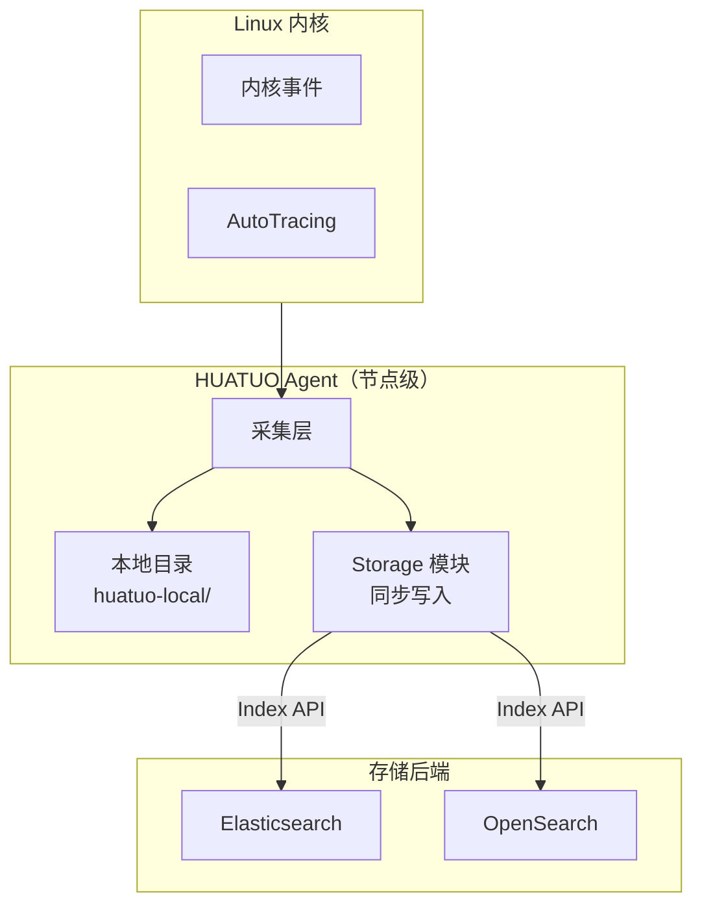
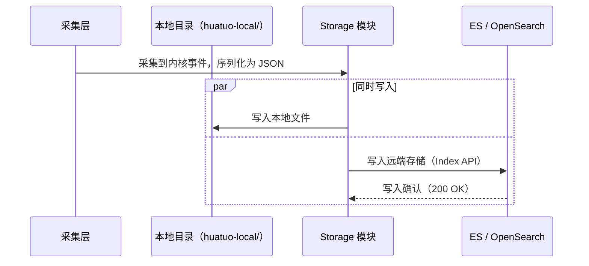
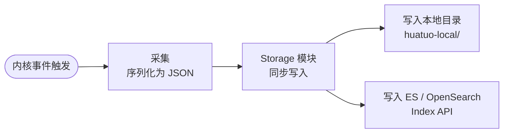

{}
<div style="text-align: center;">
HUATUO（华佗）是由滴滴开源并依托 CCF（中国计算机学会）孵化的操作系统深度观测项目，专注为云原生通用计算、AI 计算、云服务、基础服务等提供操作系统内核级深度观测能力。
</div>
{}

## 📖 概述

HUATUO（华佗）支持将采集到的 Linux 内核事件与 AutoTracing 数据持久化写入外部存储后端。当前支持 Elasticsearch 和 OpenSearch 两种存储系统。

采集到的事件在序列化为 JSON 后，同时写入节点本地目录（`huatuo-local/`）和配置的远端存储后端。本地目录保留事件的本地副本，远端存储提供持久化与结构化查询能力。

本文介绍 Elasticsearch 和 OpenSearch 的配置与验证方法。示例基于 Docker 部署，生产环境只需将地址替换为实际服务地址，配置方式一致。

---

## 🎯 应用场景

### Kubernetes 云原生故障溯源

容器化环境中，Pod OOM、节点 Hung Task 等内核事件具有短暂性，日志往往在事件发生后被清理。将事件写入 Elasticsearch 或 OpenSearch 后，运维团队可按时间范围查询历史异常时间线，在事后复盘阶段精确定位间歇性故障的根因。

### AI 计算集群稳定性审计

GPU 训练集群长期运行过程中，`ras` 硬件错误、`iotracing` I/O 延迟等事件的历史分布对容量规划和硬件健康评估至关重要。将采集数据持久化后，可通过聚合查询建立节点稳定性基线，为主动维护提供数据依据。

### 合规与事件留存

等保合规要求系统异常事件具备可追溯性。将 HUATUO 采集的内核事件写入 OpenSearch 并配置索引生命周期策略，可满足对事件留存周期和查询能力的合规要求。

### 可观测性平台集成

Elasticsearch 和 OpenSearch 均提供与 Grafana 的原生数据源对接能力。将 HUATUO 事件写入存储后，可在 Grafana 中构建内核事件趋势面板，与应用层指标叠加展示，实现历史数据分析与告警回顾。

---

## 💎 价值

| 维度         | 仅本地存储                          | 接入外部存储后端                              |
|------------|-----------------------------------|----------------------------------------------|
| 数据持久性  | 受节点磁盘容量限制，重启后可能丢失    | 数据持久化至分布式存储，支持长期保留           |
| 查询能力    | 无结构化查询，依赖文件搜索            | 支持全文检索、字段过滤、时间范围聚合           |
| 可视化集成  | 不支持                              | 可直接对接 Grafana、Kibana 等可视化平台        |
| 多节点汇聚  | 数据分散在各节点本地                  | 集中写入统一存储，支持跨节点查询               |
| 合规留存    | 难以满足留存周期要求                  | 可配置索引生命周期策略，满足合规留存要求       |

---

## 🚀 使用

### OpenSearch 存储

#### 1. 部署 OpenSearch

```bash
docker pull opensearchproject/opensearch:2.6.0
docker run -d --name opensearch -p 9200:9200 -p 9600:9600 \
    -e "discovery.type=single-node" \
    opensearchproject/opensearch:2.6.0
```

#### 2. 验证服务状态

```bash
curl -k -u admin:admin https://localhost:9200
```

返回示例：

```json
{
  "name" : "22ca72df78c0",
  "cluster_name" : "docker-cluster",
  "cluster_uuid" : "yxb3foceQVKzXXO6bHpPHQ",
  "version" : {
    "distribution" : "opensearch",
    "number" : "2.6.0",
    "build_type" : "tar",
    "build_hash" : "7203a5af21a8a009aece1474446b437a3c674db6",
    "build_date" : "2023-02-24T18:57:04.388618985Z",
    "build_snapshot" : false,
    "lucene_version" : "9.5.0",
    "minimum_wire_compatibility_version" : "7.10.0",
    "minimum_index_compatibility_version" : "7.0.0"
  },
  "tagline" : "The OpenSearch Project: https://opensearch.org/"
}
```

若验证失败，可通过以下命令查看容器日志：

```bash
docker logs opensearch
```

#### 3. 配置 huatuo-bamai

在 `huatuo-bamai.conf` 中添加以下配置。OpenSearch 容器镜像默认用户名和密码均为 `admin`。存储配置的详细说明请参见《配置指南》章节。

```toml
[Storage.ES]
    Address = "https://127.0.0.1:9200"
    Index = "huatuo_bamai"
    Username = "admin"
    Password = "admin"
```

#### 4. 启动 huatuo-bamai

通过 `--config-dir` 指定配置文件所在目录：

```bash
./_output/bin/huatuo-bamai --region dev --config-dir .
```

当本地存储目录 `huatuo-local/` 中生成文件（例如 `net_rx_latency`）时，说明已成功采集到内核事件。可使用以下命令从 OpenSearch 查询数据：

```bash
curl -k -u admin:admin \
    -X GET "https://localhost:9200/huatuo_bamai/_search?pretty" \
    -H "Content-Type: application/json" \
    -d '{"query": {"match_all": {}}}'
```

返回示例：

```json
{
    "_index" : "huatuo_bamai",
    "_id" : "yjPG_50Bu_OF-hukxKR7",
    "_score" : 1.0,
    "_source" : {
      "hostname" : "hostname",
      "region" : "dev",
      "uploaded_time" : "2026-05-07T00:11:49.753166222Z",
      "time" : "2026-05-07 00:11:49.753 +0000",
      "tracer_name" : "net_rx_latency",
      "tracer_time" : "2026-05-07 00:11:49.753 +0000",
      "tracer_type" : "auto",
      "tracer_data" : {
        "comm" : "<nil>",
        "pid" : 0,
        "where" : "TO_NETIF_RCV",
        "latency_ms" : 1776078133565,
        "saddr" : "127.0.0.1",
        "daddr" : "127.0.0.1",
        "sport" : 37736,
        "dport" : 9200,
        "seq" : 1080592402,
        "ack_seq" : 2465063876,
        "pkt_len" : 781
      }
    }
}
```

查看文档记录总数，不查看具体列表。

```bash
curl -k -u admin:admin -X GET "https://localhost:9200/huatuo_bamai/_count?pretty"
```

返回示例：其中 count 数字 = 写入记录的总数。
```json
{
  "count" : 2680,
  "_shards" : {
    "total" : 1,
    "successful" : 1,
    "skipped" : 0,
    "failed" : 0
  }
}
```

---

### Elasticsearch V8

#### 1. 部署 Elasticsearch

```bash
docker pull docker.elastic.co/elasticsearch/elasticsearch:8.15.5
docker run -d --name elasticsearch -p 9200:9200 -p 9300:9300 \
    -e "discovery.type=single-node" \
    -e "ES_JAVA_OPTS=-Xms1g -Xmx1g" \
    -e "ELASTIC_PASSWORD=123456" \
    docker.elastic.co/elasticsearch/elasticsearch:8.15.5
```

#### 2. 验证服务状态

```bash
curl -k -u elastic:123456 https://localhost:9200
```

返回示例：

```json
{
  "name" : "ab0b562f8dbd",
  "cluster_name" : "docker-cluster",
  "cluster_uuid" : "aVfOVgJTQXuhZ3HGotK3ww",
  "version" : {
    "number" : "8.15.5",
    "build_flavor" : "default",
    "build_type" : "docker",
    "build_hash" : "b10896bcfe167cce44a84ba2771d101fb596d40d",
    "build_date" : "2024-11-21T22:06:13.985834967Z",
    "build_snapshot" : false,
    "lucene_version" : "9.11.1",
    "minimum_wire_compatibility_version" : "7.17.0",
    "minimum_index_compatibility_version" : "7.0.0"
  },
  "tagline" : "You Know, for Search"
}
```

#### 3. 配置 huatuo-bamai

在 `huatuo-bamai.conf` 中添加以下配置。Elasticsearch 容器镜像默认用户名为 `elastic`，密码通过环境变量 `ELASTIC_PASSWORD` 设置。存储配置的详细说明请参见《配置指南》章节。

```toml
[Storage.ES]
    Address = "https://127.0.0.1:9200"
    Index = "huatuo_bamai"
    Username = "elastic"
    Password = "123456"
```

#### 4. 启动 huatuo-bamai

通过 `--config-dir` 指定配置文件所在目录：

```bash
./_output/bin/huatuo-bamai --region dev --config-dir .
```

当本地存储目录 `huatuo-local/` 中生成文件（例如 `net_rx_latency`）时，说明已成功采集到内核事件。可使用以下命令从 Elasticsearch 查询数据：

```bash
curl -k -u elastic:123456 \
    -X GET "https://localhost:9200/huatuo_bamai/_search?pretty" \
    -H "Content-Type: application/json" \
    -d '{"query": {"match_all": {}}}'
```

返回示例：

```json
{
    "_index" : "huatuo_bamai",
    "_id" : "WtNZAJ4BQ8x-thPHEY1i",
    "_score" : 1.0,
    "_source" : {
      "hostname" : "hostname",
      "region" : "dev",
      "uploaded_time" : "2026-05-07T02:51:37.696263325Z",
      "time" : "2026-05-07 02:51:37.696 +0000",
      "tracer_name" : "net_rx_latency",
      "tracer_time" : "2026-05-07 02:51:37.696 +0000",
      "tracer_type" : "auto",
      "tracer_data" : {
        "comm" : "<nil>",
        "pid" : 0,
        "where" : "TO_NETIF_RCV",
        "latency_ms" : 1776078133565,
        "saddr" : "127.0.0.1",
        "daddr" : "127.0.0.1",
        "sport" : 2379,
        "dport" : 36706,
        "seq" : 950542706,
        "ack_seq" : 1960972383,
        "pkt_len" : 91
      }
    }
}
```

查看文档记录总数，不查看具体列表。

```bash
curl -k -u elastic:123456 -X GET "https://localhost:9200/huatuo_bamai/_count?pretty"
```

返回示例：其中 count 数字 = 写入记录的总数。
```json
{
  "count" : 2680,
  "_shards" : {
    "total" : 1,
    "successful" : 1,
    "skipped" : 0,
    "failed" : 0
  }
}
```

### Elasticsearch V7

V7 默认使用 HTTP，因此只需要在访问服务时替换为 HTTP 即可。

#### 1. 部署 Elasticsearch

```bash
docker pull docker.elastic.co/elasticsearch/elasticsearch:7.10.1
docker run -d --name elasticsearch -p 9200:9200 -p 9300:9300 \
    -e "discovery.type=single-node" \
    -e "ES_JAVA_OPTS=-Xms1g -Xmx1g" \
    -e "ELASTIC_PASSWORD=123456" \
    docker.elastic.co/elasticsearch/elasticsearch:7.10.1
```

#### 2. 验证服务状态

```bash
curl -k -u elastic:123456 http://localhost:9200
```

返回示例：

```json
{
  "name" : "d88c9e8df48b",
  "cluster_name" : "docker-cluster",
  "cluster_uuid" : "_ZZefWx4SniAc255t_lIVg",
  "version" : {
    "number" : "7.10.1",
    "build_flavor" : "default",
    "build_type" : "docker",
    "build_hash" : "1c34507e66d7db1211f66f3513706fdf548736aa",
    "build_date" : "2020-12-05T01:00:33.671820Z",
    "build_snapshot" : false,
    "lucene_version" : "8.7.0",
    "minimum_wire_compatibility_version" : "6.8.0",
    "minimum_index_compatibility_version" : "6.0.0-beta1"
  },
  "tagline" : "You Know, for Search"
}
```

#### 3. 配置 huatuo-bamai

```toml
[Storage.ES]
    Address = "http://127.0.0.1:9200"
    Index = "huatuo_bamai"
    Username = "elastic"
    Password = "123456"
```

#### 4. 启动 huatuo-bamai

通过 `--config-dir` 指定配置文件所在目录：

```bash
./_output/bin/huatuo-bamai --region dev --config-dir .
```

当本地存储目录 `huatuo-local/` 中生成文件（例如 `net_rx_latency`）时，说明已成功采集到内核事件。可使用以下命令从 Elasticsearch 查询数据：

```bash
curl -k -u elastic:123456 \
    -X GET "http://localhost:9200/huatuo_bamai/_search?pretty" \
    -H "Content-Type: application/json" \
    -d '{"query": {"match_all": {}}}'

或者：
curl -k -u elastic:123456 \
    -X GET "http://localhost:9200/huatuo_bamai/_count?pretty"
```

---

## ⚙️ 原理

### 系统架构

HUATUO Storage 模块部署在节点上，将采集到的内核事件同时写入本地目录和 Elasticsearch 或 OpenSearch。两种存储后端共用同一套 `[Storage.ES]` 配置接口，通过地址区分。



### 数据写入流程

HUATUO 采集到内核事件后，Storage 模块将事件同时写入本地目录和远端存储后端。两路写入并发执行，本地目录保留副本，远端存储提供持久化与查询能力。



### 存储写入流程

从内核事件产生到写入存储后端，经过采集、序列化、同步写入三个阶段。本地目录与远端存储并发写入，互不阻塞。



---

## 🌟 结尾

{}
<div style="text-align: center;">
🌟 欢迎 Star: <a href="https://github.com/ccfos/huatuo" target="_blank">https://github.com/ccfos/huatuo</a>
<br><br>
👀 欢迎订阅官方微信公众号<br>

</div>
{}
