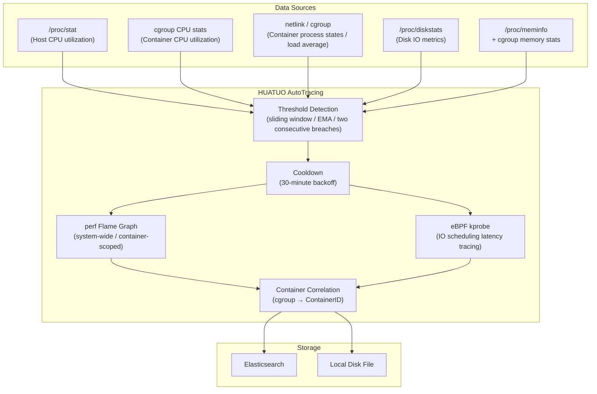
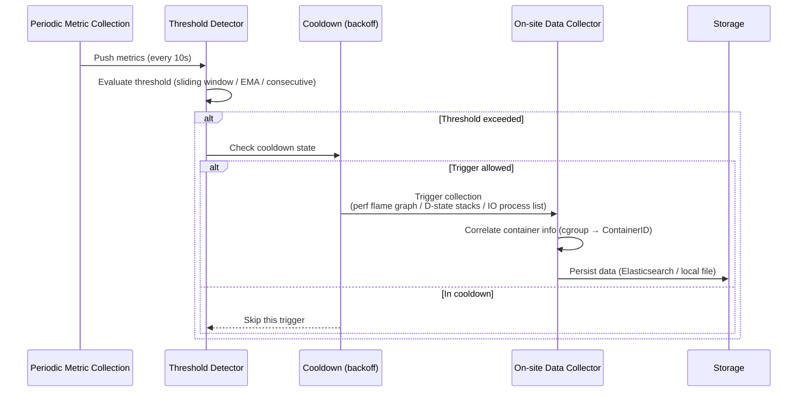

{}
<div style="text-align: center;">
HUATUO is a deep OS observability project open-sourced by Didi and incubated under CCF (China Computer Federation). It provides OS kernel-level deep observability for cloud-native general-purpose computing, AI computing, cloud services, and foundational infrastructure.
</div>
{}

## 📖 Overview

AutoTracing is an event-driven automatic diagnosis mechanism. When a host or container shows performance anomalies — such as CPU spikes, accumulation of D-state processes, saturated disk IO, or sudden memory allocation — the system triggers on-site data collection automatically based on preset thresholds, with no manual intervention required.

Collected artifacts include eBPF flame graphs (system-wide or container-scoped CPU call stack samples via `perf`), D-state process kernel call stacks, disk IO call stacks, and process memory usage rankings. Each event type has a built-in cooldown period (30 minutes by default) to prevent redundant data from continuous triggers.

Five event types are supported: `cpusys` (host CPU sys spike), `cpuidle` (container CPU usage spike), `dload` (container D-state load spike), `iotracing` (disk IO anomaly), and `memburst` (memory burst allocation).

## 🎯 Use Cases

**CPU Hotspot Analysis for AI Training Jobs**: In GPU training clusters, intermittent training stalls are often caused by sudden increases in kernel-mode CPU usage (`cpusys`). When sys utilization exceeds the threshold, AutoTracing immediately triggers a system-wide perf flame graph collection, persisting kernel call stack hotspots as structured flame graph data (`flamedata`) for offline analysis after the anomaly has passed.

**Container CPU Jitter Analysis in Kubernetes**: In microservice architectures, brief container CPU spikes (`cpuidle`) may cause response timeouts, but the issue often recovers before alert responders can act. When container CPU exceeds the threshold, AutoTracing triggers container-scoped perf sampling and generates a flame graph scoped to the container's cgroup, identifying hotspot functions and reducing time spent on log-based investigation.

**D-State Process Accumulation in Cloud-Native Environments**: Under high IO load or storage jitter, containers may accumulate large numbers of D-state (uninterruptible sleep) processes, causing system stalls. The `dload` event applies an exponential weighted moving average (EMA) to the container's uninterruptible process load. When the EMA exceeds the threshold, kernel call stacks are collected for all D-state processes inside the container and on the host, pinpointing the blocking root cause.

**Disk IO Bottleneck Root Cause Analysis**: In data-intensive or log-heavy workloads, saturated disk IO utilization or write bandwidth causes application request backlog. `iotracing` continuously polls `/proc/diskstats` and triggers when any IO metric exceeds its threshold for two consecutive samples. It then collects a list of high-IO processes (with per-process read/write byte counts and open file details) and kernel call stacks of processes waiting in IO scheduling, narrowing down the processes responsible for high disk IO consumption.

## 🚀 Usage

### Configuration

All events provide default values and work without configuration:

| Parameter | Default | Description |
| --------- | ------- | ----------- |
| `cpuidle.user_threshold` | `75` (%) | Container CPU user utilization trigger threshold |
| `cpuidle.sys_threshold` | `45` (%) | Container CPU sys utilization trigger threshold |
| `cpuidle.usage_threshold` | `90` (%) | Container total CPU utilization trigger threshold |
| `cpuidle.delta_user_threshold` | `45` (%) | Container CPU user utilization delta trigger threshold |
| `cpuidle.delta_sys_threshold` | `20` (%) | Container CPU sys utilization delta trigger threshold |
| `cpuidle.delta_usage_threshold` | `55` (%) | Container total CPU utilization delta trigger threshold |
| `cpuidle.interval` | `10` (s) | Detection interval |
| `cpuidle.interval_tracing` | `1800` (s) | Per-container cooldown period between triggers |
| `cpuidle.run_tracing_tool_timeout` | `10` (s) | perf flame graph collection timeout |
| `cpusys.sys_threshold` | `45` (%) | Host CPU sys utilization trigger threshold |
| `cpusys.delta_sys_threshold` | `20` (%) | Host CPU sys utilization delta trigger threshold |
| `cpusys.interval` | `10` (s) | Detection interval |
| `cpusys.run_tracing_tool_timeout` | `10` (s) | perf flame graph collection timeout |
| `dload.threshold_load` | `5` | Container D-state process load EMA trigger threshold |
| `dload.interval` | `10` (s) | Detection interval |
| `dload.interval_tracing` | `1800` (s) | Per-container cooldown period between triggers |
| `iotracing.rbps_threshold` | `2000` (MB/s) | Disk read throughput trigger threshold |
| `iotracing.wbps_threshold` | `1500` (MB/s) | Disk write throughput trigger threshold |
| `iotracing.util_threshold` | `90` (%) | Disk IO utilization trigger threshold |
| `iotracing.await_threshold` | `100` (ms) | Disk IO average wait time trigger threshold |
| `iotracing.run_tracing_tool_timeout` | `10` (s) | IO call stack collection timeout |
| `iotracing.max_proc_dump` | `10` | Maximum number of high-IO processes to collect |
| `iotracing.max_files_per_proc_dump` | `5` | Maximum open files to collect per process |
| `memburst.delta_memory_burst` | `100` (%) | Anonymous memory growth rate threshold relative to the oldest sample in the sliding window (100% means ≥ 2× triggers) |
| `memburst.delta_anon_threshold` | `70` (%) | Anonymous memory as a percentage of total host memory threshold |
| `memburst.interval` | `10` (s) | Detection interval |
| `memburst.interval_tracing` | `1800` (s) | Cooldown period between triggers |
| `memburst.sliding_window_length` | `60` | Sliding window sample count (corresponding to 600 seconds of history) |
| `memburst.dump_process_max_num` | `10` | Maximum number of top memory-consuming processes to collect |

### Event List

| Event Name (tracer_name) | Target | Trigger Condition | Typical Scenario |
| ------------------------ | ------ | ----------------- | ---------------- |
| `cpusys` | Host | sys > 45% or delta_sys > 20% | Kernel-mode CPU spike, syscall hotspot |
| `cpuidle` | Container | (user>75% and delta_user>45%) or (sys>45% and delta_sys>20%) or (total>90% and delta_total>55%) | Container CPU spike, hotspot function analysis |
| `dload` | Container | D-state process load EMA > 5 | D-state process accumulation, IO blocking |
| `iotracing` | Host | Any IO metric exceeds threshold for two consecutive samples | Saturated disk IO, high IO wait latency |
| `memburst` | Host | Anonymous memory ≥ 2× oldest window sample and ≥ 70% of total memory | Memory burst allocation, OOM precursor |

### Fields

All event records include the following common fields:

- **hostname**: Physical host hostname
- **region**: Availability zone of the physical host
- **uploaded_time**: Data upload timestamp
- **container_id**: Container ID if the event is associated with a container
- **container_hostname**: Container hostname if the event is associated with a container
- **container_host_namespace**: Kubernetes namespace of the container
- **container_type**: Container type (e.g., `normal`, `sidecar`)
- **container_qos**: Container QoS level
- **tracer_name**: Event name (e.g., `cpusys`, `memburst`)
- **tracer_id**: Tracing session ID
- **tracer_time**: Time when the tracing was triggered
- **tracer_type**: Trigger type (manual or automatic)
- **tracer_data**: Event-specific private data (see individual event descriptions below)

### 1. cpusys

**Description** Periodically reads `/proc/stat` to calculate host CPU sys utilization and the delta between consecutive samples. When sys utilization exceeds the threshold (default 45%) or the delta exceeds its threshold (default 20%), a system-wide perf sampling run is triggered to generate a full-host CPU flame graph.

**Storage** Event data is automatically stored in Elasticsearch or a local disk file.

**Sample Data**

```json
{
    "tracer_name": "cpusys",
    "tracer_data": {
        "now_sys": 52,
        "sys_threshold": 45,
        "deltasys": 25,
        "deltasys_threshold": 20,
        "flamedata": [
            {"level": 0, "value": 1000, "self": 0, "label": "all"},
            {"level": 1, "value": 350, "self": 350, "label": "do_syscall_64"}
        ]
    }
}
```

**Field Descriptions**

- **now_sys**: Host CPU sys utilization at trigger time (%)
- **sys_threshold**: sys utilization trigger threshold (%)
- **deltasys**: sys utilization delta between consecutive samples (%)
- **deltasys_threshold**: sys delta trigger threshold (%)
- **flamedata**: Flame graph frame data from perf sampling. Each frame contains:
  - **level**: Call stack depth level
  - **value**: Sample count for this frame including descendant frames
  - **self**: Sample count for this frame excluding descendant frames
  - **label**: Function or process name label

### 2. cpuidle

**Description** Periodically reads container cgroup CPU statistics to calculate container CPU user, sys, and total utilization along with their inter-sample deltas. A trigger fires if any of the following conditions holds: (user>75% and delta_user>45%), or (sys>45% and delta_sys>20%), or (total>90% and delta_total>55%). Container-scoped perf sampling is then run to generate a flame graph. A 30-minute per-container cooldown prevents repeated triggers. Specific containers can be excluded via the `filter` configuration.

**Storage** Event data is automatically stored in Elasticsearch or a local disk file.

**Sample Data**

```json
{
    "tracer_name": "cpuidle",
    "tracer_data": {
        "user": 80,
        "user_threshold": 75,
        "deltauser": 48,
        "deltauser_threshold": 45,
        "sys": 12,
        "sys_threshold": 45,
        "deltasys": 5,
        "deltasys_threshold": 20,
        "usage": 92,
        "usage_threshold": 90,
        "deltausage": 53,
        "deltausage_threshold": 55,
        "flamedata": [
            {"level": 0, "value": 1000, "self": 0, "label": "all"},
            {"level": 1, "value": 800, "self": 800, "label": "java/com.example.App.main"}
        ]
    }
}
```

**Field Descriptions**

- **user / user_threshold**: Container CPU user utilization at trigger time (%) and its threshold
- **deltauser / deltauser_threshold**: User utilization inter-sample delta (%) and its threshold
- **sys / sys_threshold**: Container CPU sys utilization at trigger time (%) and its threshold
- **deltasys / deltasys_threshold**: Sys utilization inter-sample delta (%) and its threshold
- **usage / usage_threshold**: Container total CPU utilization at trigger time (%) and its threshold
- **deltausage / deltausage_threshold**: Total utilization inter-sample delta (%) and its threshold
- **flamedata**: Container-scoped perf flame graph frame data; field meanings same as `cpusys`

### 3. dload

**Description** Reads container process states via netlink and cgroup, then computes an exponential weighted moving average (EMA) of the load contribution from uninterruptible (D-state) processes per container. When the EMA exceeds the threshold (default 5), kernel call stacks are collected for all D-state processes inside the container and on the host. Known-issue filtering (`issues_list`) reduces false positives. A 30-minute per-container cooldown applies.

**Storage** Event data is automatically stored in Elasticsearch or a local disk file.

**Sample Data**

```json
{
    "tracer_name": "dload",
    "tracer_data": {
        "threshold": 5,
        "nr_sleeping": 120,
        "nr_running": 4,
        "nr_stopped": 0,
        "nr_uninterruptible": 8,
        "nr_iowait": 3,
        "load_avg": 7.23,
        "dload_avg": 6.81,
        "known_issue": "",
        "stack": "task:java            state:D stack:    0 pid: 12345 tgid: 12345 ...\n  io_schedule+0x18/0x40\n  ext4_file_write_iter+0x..."
    }
}
```

**Field Descriptions**

- **threshold**: D-state load EMA trigger threshold
- **nr_sleeping**: Number of sleeping processes in the container
- **nr_running**: Number of running processes in the container
- **nr_stopped**: Number of stopped processes in the container
- **nr_uninterruptible**: Number of uninterruptible (D-state) processes in the container
- **nr_iowait**: Number of IO-waiting processes in the container
- **load_avg**: Container load average at trigger time
- **dload_avg**: Container D-state load EMA value at trigger time
- **known_issue**: Matched known issue description (empty if none matched)
- **stack**: Kernel call stacks of D-state processes (multi-process, multi-line text)

### 4. iotracing

**Description** Polls `/proc/diskstats` at 5-second intervals to calculate per-disk read/write throughput, IO utilization, and IO wait time. md devices are excluded automatically. A trigger fires when any metric exceeds its threshold for two consecutive samples. On trigger, the system collects a list of high-IO processes (with per-process read/write byte counts and open file details) and kernel call stacks of processes waiting in IO scheduling.

**Storage** Event data is automatically stored in Elasticsearch or a local disk file.

**Sample Data**

```json
{
    "tracer_name": "iotracing",
    "tracer_data": {
        "reason_snapshot": {
            "type": "ioutil",
            "device": "sda",
            "iostatus": {
                "read_bps": 120,
                "read_iops": 450,
                "read_await": 12,
                "write_bps": 2100,
                "write_iops": 890,
                "write_await": 145,
                "io_util": 95,
                "queue_size": 32
            }
        },
        "process_io_data": [
            {
                "pid": 12345,
                "comm": "java",
                "container_hostname": "app-pod-xxx",
                "fs_read": 0,
                "fs_write": 52428800,
                "disk_read": 0,
                "disk_write": 49152000,
                "file_stat": ["/data/logs/app.log"],
                "file_count": 1
            }
        ],
        "timeout_io_stack": [
            {
                "pid": 12345,
                "comm": "java",
                "container_hostname": "app-pod-xxx",
                "latency_us": 250000,
                "stack": {
                    "back_trace": [
                        "io_schedule+0x18/0x40",
                        "ext4_file_write_iter+0x2a0/0x4c0"
                    ]
                }
            }
        ]
    }
}
```

**Field Descriptions**

- **reason_snapshot**: Snapshot of the condition that triggered IO collection
  - **type**: Trigger type (`ioutil` IO utilization / `read_bps` read throughput / `write_bps` write throughput / `read_await` read wait time / `write_await` write wait time)
  - **device**: Name of the disk device that exceeded the threshold
  - **iostatus**: Disk IO metric snapshot at trigger time (`read_bps`/`write_bps` in MB/s, `read_await`/`write_await` in ms, `io_util` in %, `queue_size` is queue depth)
- **process_io_data**: List of high-IO processes. Each record contains:
  - **pid / comm**: Process PID and name
  - **container_hostname**: Container hostname of the process (empty for host processes)
  - **fs_read / fs_write**: Bytes read/written at the filesystem layer
  - **disk_read / disk_write**: Bytes actually read/written at the disk layer
  - **file_stat**: List of file paths currently open by the process
  - **file_count**: Total number of files open by the process
- **timeout_io_stack**: Call stacks of processes waiting in IO scheduling. Each record contains:
  - **pid / comm**: Process PID and name
  - **container_hostname**: Container hostname of the process
  - **latency_us**: IO wait duration (microseconds)
  - **stack.back_trace**: List of kernel call stack frames

### 5. memburst

**Description** Periodically samples host anonymous memory usage and maintains a sliding window of 60 samples (corresponding to 600 seconds). A trigger fires when current anonymous memory is ≥ 2× the oldest sample in the window and anonymous memory accounts for ≥ 70% of total host memory. On trigger, the top N processes by memory consumption (default 10) are collected, recording their PID, process name, and RSS memory size. A 30-minute cooldown applies.

**Storage** Event data is automatically stored in Elasticsearch or a local disk file.

**Sample Data**

```json
{
    "tracer_name": "memburst",
    "tracer_data": {
        "top_memory_usage": [
            {
                "pid": 3456,
                "process_name": "java",
                "memory_size": 8589934592
            },
            {
                "pid": 3789,
                "process_name": "python3",
                "memory_size": 2147483648
            }
        ]
    }
}
```

**Field Descriptions**

- **top_memory_usage**: List of top memory-consuming processes sorted by RSS in descending order. Each record contains:
  - **pid**: Process PID
  - **process_name**: Process name
  - **memory_size**: Process RSS memory usage (bytes)

## ⚙️ Principle

### Architecture

AutoTracing is built on periodic polling, combined with eBPF call stack collection and perf flame graph generation, to collect anomaly diagnostic data at the kernel level with low overhead.



### Event Processing Flow



{}
<div style="text-align: center;">
🌟 Star us: <a href="https://github.com/ccfos/huatuo" target="_blank">https://github.com/ccfos/huatuo</a>
<br><br>
👀 Follow our official WeChat public account<br>

</div>
{}
