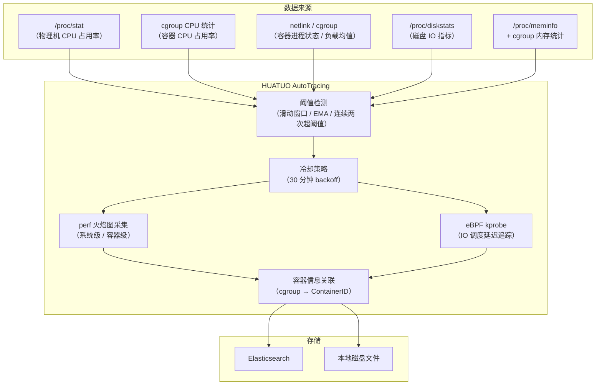
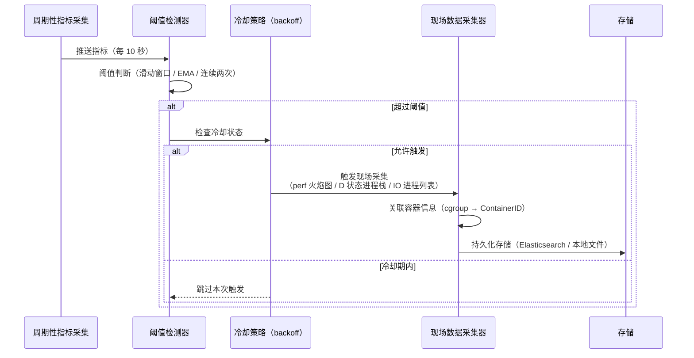

{}
<div style="text-align: center;">
HUATUO（华佗）是由滴滴开源并依托 CCF（中国计算机学会）孵化的操作系统深度观测项目，专注为云原生通用计算、AI 计算、云服务、基础服务等提供操作系统内核级深度观测能力。
</div>
{}

## 📖 概述

HUATUO AutoTracing（全自动化追踪）是一种事件驱动的自动诊断机制。当物理机或容器出现 CPU 突增、D 状态进程堆积、磁盘 IO 打满、内存突发分配等性能异常时，系统依据预设阈值自动触发现场数据采集，无需人工介入即可保留完整的诊断快照。

采集内容包括 eBPF 火焰图（`perf` 工具系统级或容器级 CPU 调用栈采样）、D 状态进程内核调用栈、磁盘 IO 调用栈、进程内存使用排行等。为避免持续触发导致的数据冗余，各事件均内置冷却策略（默认 30 分钟），确保在事件风暴期间仅保留关键快照。

当前支持 5 类事件：`cpusys`（物理机 CPU sys 突增）、`cpuidle`（容器 CPU 使用率突增）、`dload`（容器 D 状态负载突增）、`iotracing`（磁盘 IO 异常）、`memburst`（内存突发分配）。

## 🎯 场景

**AI 训练任务 CPU 热点定位**：在 GPU 训练集群中，训练任务偶发性卡顿往往由内核态 CPU 占用率突增（`cpusys`）引起。AutoTracing 在 sys 占用率超过阈值的瞬间自动触发系统级 perf 火焰图采集，将内核调用栈热点以火焰图数据结构（`flamedata`）持久化，支持在故障消失后进行离线分析，避免人工复现困难。

**Kubernetes 容器 CPU 性能毛刺分析**：在微服务架构中，容器 CPU 使用率（`cpuidle`）的短暂突增可能导致响应延迟超时，但问题往往在告警响应前已恢复。AutoTracing 在容器 CPU 超阈值时自动触发容器级 perf 采样，生成精确到容器 cgroup 范围的火焰图，快速定位热点函数，降低依赖日志排查的时间成本。

**云原生环境 D 状态进程堆积排查**：在高 IO 负载或存储抖动时，容器内可能出现大量 D 状态（不可中断睡眠）进程，导致系统卡顿。`dload` 事件通过对容器负载均值进行指数加权移动平均（EMA）计算，在 D 状态进程负载超过阈值时自动抓取容器内及宿主机上相关进程的内核调用栈，精准定位阻塞根因。

**磁盘 IO 瓶颈根因定位**：在大数据或日志密集型业务中，磁盘 IO 利用率或写入带宽打满会导致应用请求堆积。`iotracing` 持续轮询 `/proc/diskstats`，在磁盘 IO 指标连续两次超过阈值时触发，采集高 IO 进程列表（含各进程读写字节数与打开文件详情）及正在等待 IO 调度的进程内核调用栈，快速缩小磁盘 IO 高消耗的进程范围。

## 🚀 使用

### 配置参数

各事件可通过以下参数进行调优，参数均提供默认值，无需配置即可运行：

| 参数 | 默认值 | 说明 |
| ---- | ------ | ---- |
| `cpuidle.user_threshold` | `75`（%） | 容器 CPU user 占用率触发阈值 |
| `cpuidle.sys_threshold` | `45`（%） | 容器 CPU sys 占用率触发阈值 |
| `cpuidle.usage_threshold` | `90`（%） | 容器 CPU 总占用率触发阈值 |
| `cpuidle.delta_user_threshold` | `45`（%） | 容器 CPU user 占用率增量触发阈值 |
| `cpuidle.delta_sys_threshold` | `20`（%） | 容器 CPU sys 占用率增量触发阈值 |
| `cpuidle.delta_usage_threshold` | `55`（%） | 容器 CPU 总占用率增量触发阈值 |
| `cpuidle.interval` | `10`（秒） | 检测间隔 |
| `cpuidle.interval_tracing` | `1800`（秒） | 同一容器触发冷却时间 |
| `cpuidle.run_tracing_tool_timeout` | `10`（秒） | perf 火焰图采集超时 |
| `cpusys.sys_threshold` | `45`（%） | 物理机 CPU sys 占用率触发阈值 |
| `cpusys.delta_sys_threshold` | `20`（%） | 物理机 CPU sys 占用率增量触发阈值 |
| `cpusys.interval` | `10`（秒） | 检测间隔 |
| `cpusys.run_tracing_tool_timeout` | `10`（秒） | perf 火焰图采集超时 |
| `dload.threshold_load` | `5` | 容器不可中断进程负载 EMA 触发阈值 |
| `dload.interval` | `10`（秒） | 检测间隔 |
| `dload.interval_tracing` | `1800`（秒） | 同一容器触发冷却时间 |
| `iotracing.rbps_threshold` | `2000`（MB/s） | 磁盘读吞吐率触发阈值 |
| `iotracing.wbps_threshold` | `1500`（MB/s） | 磁盘写吞吐率触发阈值 |
| `iotracing.util_threshold` | `90`（%） | 磁盘 IO 利用率触发阈值 |
| `iotracing.await_threshold` | `100`（ms） | 磁盘 IO 平均等待时间触发阈值 |
| `iotracing.run_tracing_tool_timeout` | `10`（秒） | IO 调用栈采集超时 |
| `iotracing.max_proc_dump` | `10` | 最多采集的高 IO 进程数 |
| `iotracing.max_files_per_proc_dump` | `5` | 每个进程最多采集的打开文件数 |
| `memburst.delta_memory_burst` | `100`（%） | 匿名内存相对滑动窗口最早采样的增长率阈值（100% 即 ≥ 2 倍时触发） |
| `memburst.delta_anon_threshold` | `70`（%） | 匿名内存占物理机总内存的比例阈值 |
| `memburst.interval` | `10`（秒） | 检测间隔 |
| `memburst.interval_tracing` | `1800`（秒） | 触发冷却时间 |
| `memburst.sliding_window_length` | `60` | 滑动窗口采样数（对应 600 秒历史数据） |
| `memburst.dump_process_max_num` | `10` | 最多采集的内存消耗进程数 |

### 事件列表

| 事件名称（tracer_name） | 观测对象 | 触发条件 | 典型场景 |
| ----------------------- | -------- | -------- | -------- |
| `cpusys` | 物理机 | sys > 45% 或 delta_sys > 20% | 内核态 CPU 突增、系统调用热点 |
| `cpuidle` | 容器 | (user>75% 且 delta_user>45%) 或 (sys>45% 且 delta_sys>20%) 或 (total>90% 且 delta_total>55%) | 容器 CPU 使用率突增、热点函数分析 |
| `dload` | 容器 | 不可中断进程负载 EMA > 5 | D 状态进程堆积、IO 阻塞 |
| `iotracing` | 物理机 | 磁盘 IO 指标连续两次超阈值 | 磁盘 IO 打满、IO 等待高延迟 |
| `memburst` | 物理机 | 匿名内存 ≥ 窗口最早值 2 倍且占总内存 ≥ 70% | 内存突发分配、OOM 前兆 |

### 通用字段说明

所有事件数据均包含以下通用字段：

- **hostname**：物理机 hostname
- **region**：物理机所在可用区
- **uploaded_time**：数据上传时间
- **container_id**：如果事件关联容器，则记录的容器 ID
- **container_hostname**：如果事件关联容器，则记录的容器 hostname
- **container_host_namespace**：如果事件关联容器，则记录容器的 K8s 命名空间
- **container_type**：容器类型
- **container_qos**：容器 QoS 级别
- **tracer_name**：事件名称（如 `cpusys`、`memburst` 等）
- **tracer_id**：此次的 tracing ID
- **tracer_time**：触发 tracing 时间
- **tracer_type**：触发类型（手动触发或自动触发）
- **tracer_data**：特定事件私有数据（详见各事件说明）

### 1. cpusys

**功能描述** 周期性读取 `/proc/stat`，计算物理机 CPU sys 占用率及相邻两次采样的增量。当 sys 占用率超过阈值（默认 45%）或增量超过阈值（默认 20%）时，触发系统级 perf 采样，生成全机 CPU 火焰图数据。

**数据存储** 事件数据自动存储至 Elasticsearch 或物理机磁盘文件。

**示例数据**

```json
{
    "tracer_name": "cpusys",
    "tracer_data": {
        "now_sys": 52,
        "sys_threshold": 45,
        "deltasys": 25,
        "deltasys_threshold": 20,
        "flamedata": [
            {"level": 0, "value": 1000, "self": 0, "label": "all"},
            {"level": 1, "value": 350, "self": 350, "label": "do_syscall_64"}
        ]
    }
}
```

**字段含义解释**

- **now_sys**：触发时物理机 CPU sys 占用率（%）
- **sys_threshold**：sys 占用率触发阈值（%）
- **deltasys**：相邻两次采样的 sys 占用率增量（%）
- **deltasys_threshold**：sys 增量触发阈值（%）
- **flamedata**：perf 采样生成的火焰图帧数据列表，每帧包含：
  - **level**：调用栈层级深度
  - **value**：该帧（含子帧）的采样计数
  - **self**：该帧自身（不含子帧）的采样计数
  - **label**：函数或进程名称标签

### 2. cpuidle

**功能描述** 周期性读取容器 cgroup CPU 统计，计算容器 CPU user、sys、总占用率及各指标的相邻增量。当任意一组阈值条件成立时（user>75% 且 delta_user>45%，或 sys>45% 且 delta_sys>20%，或 total>90% 且 delta_total>55%），触发容器级 perf 采样生成火焰图。同一容器默认 30 分钟冷却，避免重复触发。支持通过容器过滤器（`filter`）排除特定容器。

**数据存储** 事件数据自动存储至 Elasticsearch 或物理机磁盘文件。

**示例数据**

```json
{
    "tracer_name": "cpuidle",
    "tracer_data": {
        "user": 80,
        "user_threshold": 75,
        "deltauser": 48,
        "deltauser_threshold": 45,
        "sys": 12,
        "sys_threshold": 45,
        "deltasys": 5,
        "deltasys_threshold": 20,
        "usage": 92,
        "usage_threshold": 90,
        "deltausage": 53,
        "deltausage_threshold": 55,
        "flamedata": [
            {"level": 0, "value": 1000, "self": 0, "label": "all"},
            {"level": 1, "value": 800, "self": 800, "label": "java/com.example.App.main"}
        ]
    }
}
```

**字段含义解释**

- **user / user_threshold**：触发时容器 CPU user 占用率（%）及其阈值
- **deltauser / deltauser_threshold**：user 占用率增量（%）及其阈值
- **sys / sys_threshold**：触发时容器 CPU sys 占用率（%）及其阈值
- **deltasys / deltasys_threshold**：sys 占用率增量（%）及其阈值
- **usage / usage_threshold**：触发时容器 CPU 总占用率（%）及其阈值
- **deltausage / deltausage_threshold**：总占用率增量（%）及其阈值
- **flamedata**：容器级 perf 采样火焰图帧数据，字段含义同 `cpusys`

### 3. dload

**功能描述** 通过 netlink 及 cgroup 读取容器内进程状态，对不可中断（D 状态）进程的负载贡献进行指数加权移动平均（EMA）计算。当容器 D 状态负载 EMA 超过阈值（默认 5）时，采集容器内及宿主机中所有 D 状态进程的内核调用栈，支持已知问题过滤（`issues_list`）降低误报率。同一容器默认 30 分钟冷却。

**数据存储** 事件数据自动存储至 Elasticsearch 或物理机磁盘文件。

**示例数据**

```json
{
    "tracer_name": "dload",
    "tracer_data": {
        "threshold": 5,
        "nr_sleeping": 120,
        "nr_running": 4,
        "nr_stopped": 0,
        "nr_uninterruptible": 8,
        "nr_iowait": 3,
        "load_avg": 7.23,
        "dload_avg": 6.81,
        "known_issue": "",
        "stack": "task:java            state:D stack:    0 pid: 12345 tgid: 12345 ...\n  io_schedule+0x18/0x40\n  ext4_file_write_iter+0x..."
    }
}
```

**字段含义解释**

- **threshold**：D 状态负载 EMA 触发阈值
- **nr_sleeping**：容器内睡眠状态进程数
- **nr_running**：容器内运行状态进程数
- **nr_stopped**：容器内停止状态进程数
- **nr_uninterruptible**：容器内不可中断（D 状态）进程数
- **nr_iowait**：容器内 IO 等待状态进程数
- **load_avg**：触发时容器负载均值
- **dload_avg**：触发时容器 D 状态负载 EMA 值
- **known_issue**：命中的已知问题描述（为空表示未命中）
- **stack**：D 状态进程的内核调用栈（多进程多行文本）

### 4. iotracing

**功能描述** 以 5 秒间隔轮询 `/proc/diskstats`，计算各磁盘设备的读写吞吐率、IO 利用率及 IO 等待时间。当任一指标连续两次采样均超过对应阈值时触发（自动忽略 md 设备），采集高 IO 进程列表（含各进程的读写字节数及打开文件统计）以及正在等待 IO 调度的进程内核调用栈。

**数据存储** 事件数据自动存储至 Elasticsearch 或物理机磁盘文件。

**示例数据**

```json
{
    "tracer_name": "iotracing",
    "tracer_data": {
        "reason_snapshot": {
            "type": "ioutil",
            "device": "sda",
            "iostatus": {
                "read_bps": 120,
                "read_iops": 450,
                "read_await": 12,
                "write_bps": 2100,
                "write_iops": 890,
                "write_await": 145,
                "io_util": 95,
                "queue_size": 32
            }
        },
        "process_io_data": [
            {
                "pid": 12345,
                "comm": "java",
                "container_hostname": "app-pod-xxx",
                "fs_read": 0,
                "fs_write": 52428800,
                "disk_read": 0,
                "disk_write": 49152000,
                "file_stat": ["/data/logs/app.log"],
                "file_count": 1
            }
        ],
        "timeout_io_stack": [
            {
                "pid": 12345,
                "comm": "java",
                "container_hostname": "app-pod-xxx",
                "latency_us": 250000,
                "stack": {
                    "back_trace": [
                        "io_schedule+0x18/0x40",
                        "ext4_file_write_iter+0x2a0/0x4c0"
                    ]
                }
            }
        ]
    }
}
```

**字段含义解释**

- **reason_snapshot**：触发 IO 采集的原因快照
  - **type**：触发类型（`ioutil` IO 利用率 / `read_bps` 读吞吐率 / `write_bps` 写吞吐率 / `read_await` 读等待时间 / `write_await` 写等待时间）
  - **device**：触发阈值的磁盘设备名称
  - **iostatus**：触发时各磁盘 IO 指标快照（`read_bps`/`write_bps` 单位 MB/s，`read_await`/`write_await` 单位 ms，`io_util` 单位 %，`queue_size` 为队列深度）
- **process_io_data**：高 IO 进程列表，每条记录包含：
  - **pid / comm**：进程 PID 与进程名
  - **container_hostname**：进程所在容器 hostname（宿主机进程为空）
  - **fs_read / fs_write**：进程文件系统层面的读写字节数
  - **disk_read / disk_write**：进程磁盘层面的实际读写字节数
  - **file_stat**：进程当前打开的文件路径列表
  - **file_count**：进程打开的文件总数
- **timeout_io_stack**：等待 IO 调度的进程调用栈列表，每条记录包含：
  - **pid / comm**：进程 PID 与进程名
  - **container_hostname**：进程所在容器 hostname
  - **latency_us**：IO 等待时长（微秒）
  - **stack.back_trace**：内核调用栈帧列表

### 5. memburst

**功能描述** 周期性采样物理机匿名内存（anonymous memory）使用量，维护长度为 60 个采样点（对应 600 秒）的滑动窗口。当当前匿名内存 ≥ 窗口最早采样值的 2 倍，且匿名内存占物理机总内存 ≥ 70% 时触发，采集内存消耗最多的前 N 个进程（默认 10 个）的 PID、进程名和 RSS 内存值。默认 30 分钟冷却。

**数据存储** 事件数据自动存储至 Elasticsearch 或物理机磁盘文件。

**示例数据**

```json
{
    "tracer_name": "memburst",
    "tracer_data": {
        "top_memory_usage": [
            {
                "pid": 3456,
                "process_name": "java",
                "memory_size": 8589934592
            },
            {
                "pid": 3789,
                "process_name": "python3",
                "memory_size": 2147483648
            }
        ]
    }
}
```

**字段含义解释**

- **top_memory_usage**：内存消耗最多的进程列表（按 RSS 降序排列），每条记录包含：
  - **pid**：进程 PID
  - **process_name**：进程名称
  - **memory_size**：进程 RSS 内存占用（字节）

## ⚙️ 原理

### 整体架构

HUATUO AutoTracing 以周期性轮询为基础，结合 eBPF 调用栈采集与 perf 火焰图生成，在内核层实现低开销的异常诊断数据采集。



### 事件处理流程



{}
<div style="text-align: center;">
🌟 欢迎 Star: <a href="https://github.com/ccfos/huatuo" target="_blank">https://github.com/ccfos/huatuo</a>
<br><br>
👀 欢迎订阅官方微信公众号<br>

</div>
{}
