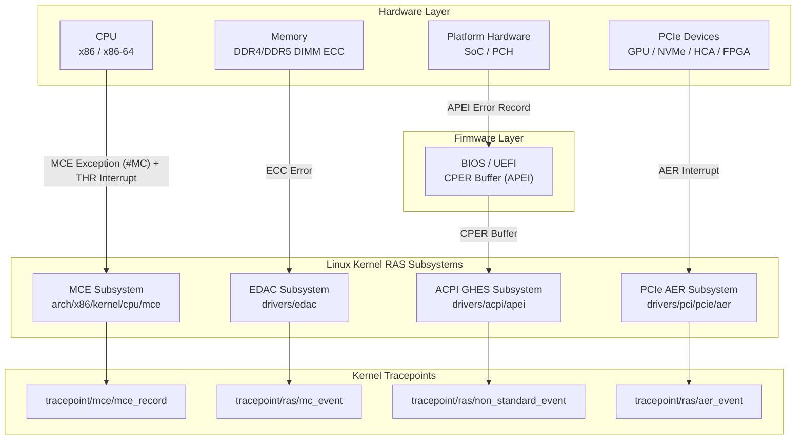

### Overview

HUATUO monitors Linux kernel hardware error events with zero instrumentation overhead and minimal runtime cost. Structured fault records are persisted to storage and exposed as Prometheus counters for use by alerting and visualization systems.

### Use Cases

- **General-Purpose Computing**

    In large-scale server clusters, memory ECC correctable errors (CE) are common low-severity fault signals. A single CE is automatically corrected by hardware. If the CE rate on a given DIMM rises persistently, however, it indicates impending memory failure. HUATUO detects such events in real time via EDAC/MCE tracepoints, enabling operations teams to perform preventive replacements before complete memory failure and unplanned downtime occur.

- **AI Computing**

    AI training workloads require high hardware reliability. A single faulty PCIe device can cause an entire training job to fail. HUATUO supports PCIe AER event monitoring and reports link-layer errors on GPUs, NVLink bridges, and RDMA NICs (such as InfiniBand HCAs) — including Data Link Protocol Errors and ECRC Errors — in real time. This data provides hardware health status to AI cluster schedulers, supporting rapid fault node isolation and workload migration.

- **Storage Services**

    Storage servers typically host large numbers of PCIe NVMe SSDs and HBA cards. PCIe AER errors such as Completion Timeout and Malformed TLP are early indicators of storage device performance degradation or drive dropout. HUATUO monitoring data can be correlated with storage I/O latency metrics to support root cause analysis.

- **Security and Compliance**

    Industries with strict compliance requirements — such as finance and government — must maintain a complete history of all hardware faults. Structured event records (including timestamps, device identifiers, error types, and raw register values) can serve directly as compliance evidence for hardware health logs.

### How It Works

HUATUO observes the kernel's MCE, EDAC, ACPI GHES, and PCIe AER subsystems via eBPF. When an eBPF tracepoint fires, the raw event is written to a BPF Perf Event Buffer. A user-space process reads the event, parses the struct fields, generates a structured record, and persists it locally or to a remote store. The overall architecture is shown below:


### RAS Architecture

The Linux kernel's RAS framework consists of several loosely coupled subsystems. Together, they cover the full hardware fault spectrum — from CPU internal errors to PCIe link errors.



- **MCE**

    MCE (Machine Check Architecture) is a hardware fault-tolerance mechanism built into the processor, defined by Intel and AMD in their respective architecture specifications. The processor contains a set of Machine Check Banks, each corresponding to a class of hardware resource (e.g., L1 cache, L2 cache, memory controller, TLB). When a hardware error is detected, the MSRs of the corresponding bank (`MCi_STATUS`, `MCi_ADDR`, `MCi_MISC`) are populated with error information, and an MCE exception is raised.

- **MCE THR**

    MCE supports a threshold interrupt mechanism. When the count of a given class of correctable errors exceeds a configured threshold, a dedicated APIC interrupt (THR) is triggered instead of escalating to a full MCE exception. This allows the operating system to issue an early alert when the error rate rises abnormally, rather than waiting until the error becomes uncorrectable.

- **EDAC**

    EDAC (Error Detection And Correction) is the Linux kernel subsystem dedicated to handling memory and hardware ECC errors. Its stated goal is "to detect and report errors occurring in the computer hardware running under Linux." EDAC drivers communicate directly with the memory controller and parse the physical location of ECC errors — including memory controller index, channel, slot, and row/column address.

- **ACPI GHES**

    ACPI GHES (Generic Hardware Error Source) is a platform-agnostic hardware error reporting mechanism defined by the BIOS/UEFI through the APEI (ACPI Platform Error Interface) specification. The BIOS firmware writes hardware errors that cannot be handled by a specific driver — such as SoC-internal errors or platform-specific memory errors — into CPER (Common Platform Error Record) buffers described in the GHES descriptor. The Linux kernel reads these CPER records and reports the "non-standard" error sections that cannot be parsed by a standard subsystem.

- **PCIe AER**

    PCIe AER (Advanced Error Reporting) is an error reporting mechanism defined in the PCIe specification. It enables PCIe devices to report link-layer and transaction-layer errors to the operating system with precision.

### Metrics Reference

- **RAS Metrics**

    ```bash
    # HELP huatuo_bamai_ras_hw_total total RAS hardware error events by source type
    # TYPE huatuo_bamai_ras_hw_total counter
    huatuo_bamai_ras_hw_total{host="hostname",region="dev",type="acpi"} 0
    huatuo_bamai_ras_hw_total{host="hostname",region="dev",type="aer"} 0
    huatuo_bamai_ras_hw_total{host="hostname",region="dev",type="edac"} 0
    huatuo_bamai_ras_hw_total{host="hostname",region="dev",type="mce"} 0
    huatuo_bamai_ras_hw_total{host="hostname",region="dev",type="thr"} 0
    ```

- **NIC Packet Drop**

    ```bash
    huatuo_bamai_netdev_hw_rx_dropped_total{host="hostname",region="dev",device="eth0",driver="ixgbe"} 0
    ```

- **RDMA PFC**

    ```bash
    # HELP huatuo_bamai_netdev_dcb_pfc_received_total count of the received pfc frames
    # TYPE huatuo_bamai_netdev_dcb_pfc_received_total counter
    huatuo_bamai_netdev_dcb_pfc_received_total{device="enp6s0f0np0",host="hostname",prio="0",region="dev"} 0
    huatuo_bamai_netdev_dcb_pfc_received_total{device="enp6s0f0np0",host="hostname",prio="1",region="dev"} 0
    huatuo_bamai_netdev_dcb_pfc_received_total{device="enp6s0f0np0",host="hostname",prio="2",region="dev"} 0
    huatuo_bamai_netdev_dcb_pfc_received_total{device="enp6s0f0np0",host="hostname",prio="3",region="dev"} 0
    huatuo_bamai_netdev_dcb_pfc_received_total{device="enp6s0f0np0",host="hostname",prio="4",region="dev"} 0
    huatuo_bamai_netdev_dcb_pfc_received_total{device="enp6s0f0np0",host="hostname",prio="5",region="dev"} 0
    huatuo_bamai_netdev_dcb_pfc_received_total{device="enp6s0f0np0",host="hostname",prio="6",region="dev"} 0
    huatuo_bamai_netdev_dcb_pfc_received_total{device="enp6s0f0np0",host="hostname",prio="7",region="dev"} 0
    # HELP huatuo_bamai_netdev_dcb_pfc_send_total count of the sent pfc frames
    # TYPE huatuo_bamai_netdev_dcb_pfc_send_total counter
    huatuo_bamai_netdev_dcb_pfc_send_total{device="enp6s0f0np0",host="hostname",prio="0",region="dev"} 0
    huatuo_bamai_netdev_dcb_pfc_send_total{device="enp6s0f0np0",host="hostname",prio="1",region="dev"} 0
    huatuo_bamai_netdev_dcb_pfc_send_total{device="enp6s0f0np0",host="hostname",prio="2",region="dev"} 0
    huatuo_bamai_netdev_dcb_pfc_send_total{device="enp6s0f0np0",host="hostname",prio="3",region="dev"} 0
    huatuo_bamai_netdev_dcb_pfc_send_total{device="enp6s0f0np0",host="hostname",prio="4",region="dev"} 0
    huatuo_bamai_netdev_dcb_pfc_send_total{device="enp6s0f0np0",host="hostname",prio="5",region="dev"} 0
    huatuo_bamai_netdev_dcb_pfc_send_total{device="enp6s0f0np0",host="hostname",prio="6",region="dev"} 0
    huatuo_bamai_netdev_dcb_pfc_send_total{device="enp6s0f0np0",host="hostname",prio="7",region="dev"} 0
    ```

- **Storage**

    Every hardware error event is persisted in structured form — either to the local `huatuo-local` directory or to a remote store such as Elasticsearch or OpenSearch. All records share the following common fields:

    ```bash
    {
        "hostname": "hostname",
        "region": "dev",
        "uploaded_time": "2026-03-05T18:28:39.153438921+08:00",
        "time": "2026-03-05 18:28:39.153 +0800",
        "tracer_name": "netdev_event",
        "tracer_time": "2026-03-05 18:28:39.153 +0800",
        "tracer_type": "auto",
        "tracer_data": {
            "ifname": "eth0",
            "index": 2,
            "linkstatus": "linkstatus_admindown",
            "mac": "5c:6f:11:11:11:11",
            "start": false
        }
    }
    ```

    The `linkstatus` field takes the following values:
    - `linkstatus_adminup` — brought up by an administrator, e.g., `ip link set dev eth0 up`
    - `linkstatus_admindown` — brought down by an administrator, e.g., `ip link set dev eth0 down`
    - `linkstatus_carrierup` — physical link restored
    - `linkstatus_carrierdown` — physical link failure

    ```bash
    {
        "hostname": "localhost",
        "region": "xxx",
        "uploaded_time": "2026-05-11T16:58:47.328548319+08:00",
        "time": "2026-05-11 16:58:47.328 +0800",
        "tracer_name": "ras",
        "tracer_time": "2026-05-11 16:58:47.328 +0800",
        "tracer_type": "auto",
        "tracer_data": {
            "dev": "MEM",
            "event": "EDAC",
            "type": "Corrected",
            "timestamp": 537792166031,
            "info": "{\"err_count\":0,\"err_type\":\"Corrected\",\"err_msg\":\"memory read error\",\"label\":\"CPU_SrcID#0_Ha#0_Chan#0_DIMM#0\",\"mc_index\":0,\"top_layer\":0,\"mid_layer\":0,\"low_layer\":-1,\"addr\":7860269056,\"grain\":128,\"syndrome\":0,\"driver\":\" area:DRAM err_code:0000:009f socket:0 ha:0 channel_mask:1 rank:0\"}"
        }
    }
    ```

    | Field | Description |
    | :---------- | :----------------------------------------------------------- |
    | `Device` | Identifier of the hardware component where the error occurred (e.g., `CPU/MEM`, `MEM`, `ACPI`, `PCIe 0000:01:00.0`) |
    | `Event` | Event subtype (`MCE`, `EDAC`, `APIC`, `AER`) |
    | `ErrType` | Error severity level (see table below) |
    | `Timestamp` | Timestamp |
    | `Info` | Detailed fields for the specific event |

    | Error Type | Description | Typical Sources |
    | --------------- | ---------------------------- | ----------------------------------------------------- |
    | `Corrected` | Automatically corrected by hardware; transparent to the OS | MCE CE, EDAC CE, ACPI Sev=1, AER Severity=2 |
    | `UncorrectedRecoverable` | Not corrected by hardware, but recoverable by system software | MCE UE, EDAC UE, ACPI Sev=2, AER Severity=0 |
    | `UncorrectedDeferred` | Not corrected by hardware; requires deferred handling | MCE MCI_STATUS_DEFERRED, EDAC HW_EVENT_ERR_DEFERRED |
    | `UncorrectedFatal` | Fatal hardware error; requires immediate reboot | EDAC FATAL, ACPI Sev=3, AER Severity=0 |
    | `Info` | Error type for which the system is expected to log informational records | EDAC HW_EVENT_ERR_INFO, ACPI Sev=0 |


### Field Reference

- **MCE**

  Monitored components: CPU cores, L1/L2/L3 cache, TLB, memory controller (IMC), and interconnect buses (QPI/UPI/Infinity Fabric).

  | Field | MSR Source | Description |
  | ------------------ | ---------------- | ------------------------------------------------------------ |
  | `mcg_cpu_cap` | `MCG_CAP` | **Machine Check Global Capability Register**. The lower 8 bits (`Count`) indicate the number of MC Banks in the system. |
  | `mcg_msr_status` | `MCG_STATUS` | **Machine Check Global Status Register**. |
  | `banks_msr_status` | `MCi_STATUS` | **Bank Status Register (primary field)**. The lower 16 bits contain the MCA error code, classifying the error type (e.g., memory hierarchy error, bus error). The upper bits include control flags: `UC` (uncorrectable), `EN` (enabled), `MISCV` (MISC valid), `ADDRV` (ADDR valid), and `PCC` (processor context corrupt). |
  | `banks_msr_addr` | `MCi_ADDR` | **Physical memory address where the error occurred** (valid only when `MCi_STATUS.ADDRV=1`). Used to identify the faulty DIMM or cache line. |
  | `banks_msr_misc` | `MCi_MISC` | **Supplementary information register** (valid only when `MCi_STATUS.MISCV=1`). |
  | `mca_synd_msr` | `MCA_SYND` | **Syndrome register** (AMD-specific). |
  | `mca_ipid_msr` | `MCA_IPID` | **Instance ID register** (AMD-specific). |
  | `instr_pointer` | RIP register | Instruction pointer at the time of the MCE (reliable only when `MCG_STATUS.EIPV=1`). |
  | `tsc_timestamp` | TSC | CPU timestamp counter value at the time of the error (can be converted to absolute time using the kernel clock). |
  | `walltime` | Kernel time | Unix timestamp (in seconds) at the time of the error. |
  | `cpu` | — | **Logical CPU number** where the MCE occurred. |
  | `cpuid` | CPUID | CPUID value of the CPU where the MCE occurred (includes Family, Model, and Stepping). |
  | `apicid` | APIC ID | APIC ID of the CPU where the MCE occurred (can be mapped to a physical core or hyperthread). |
  | `socketid` | — | CPU socket number (Socket ID). Used to identify physical CPUs in multi-socket servers. |
  | `code_seg` | CS register | Code segment register value at the time of the MCE (used to determine privilege level). |
  | `bank` | — | **Bank number** (typically: Bank 0 = L1I, Bank 1 = L1D, Bank 2 = L2, Bank 4+ = memory controller; numbering varies by platform). |
  | `cpuvendor` | — | CPU vendor identifier: `0` = Intel, `1` = Unknown, `2` = AMD. |

- **EDAC**

  Monitored components: memory ECC errors.

  | Field | Description |
  | ----------- | ------------------------------------------------------------ |
  | `err_count` | **Cumulative error count for this event**. |
  | `err_type` | Error severity level. |
  | `err_msg` | **Human-readable error description** string (e.g., `"CE memory read error on CPU#0Channel#0_DIMM#0 (channel:0 slot:0 page:0x12345 offset:0x0 grain:8 syndrome:0x0)"`). |
  | `label` | **Physical DIMM location label** (e.g., `"CPU_SrcID#0_Ha#0_Chan#0_DIMM#0"`). Generated by the EDAC driver based on DIMM topology; maps directly to a physical memory slot in the system. |
  | `mc_index` | **Memory controller index** (0-based). Distinguishes between IMCs on servers with multiple memory controllers. |
  | `top_layer` | **Top-layer index in the memory hierarchy** (typically the channel number; -1 indicates invalid). |
  | `mid_layer` | **Middle-layer index in the memory hierarchy** (typically the slot or rank number; -1 indicates invalid). |
  | `low_layer` | **Bottom-layer index in the memory hierarchy** (typically the bank or row number; -1 indicates invalid). |
  | `addr` | **Physical memory address where the error occurred** (64-bit unsigned integer; 0 indicates an invalid address). |
  | `grain` | **Error granularity (grain size, in bytes)**. Represents the smallest memory unit that may be affected. Computed as `1 << GrainBits`. For example, `grain=8` means the error is localized to an 8-byte unit (a cache line sub-block). |
  | `syndrome` | **ECC syndrome value**. |
  | `driver` | **EDAC driver name** (e.g., `"amd64_edac"`, `"sb_edac"`). |

- **ACPI GHES**

  Monitored components: platform-specific hardware errors.

  | Field | Description |
  | ---------- | ------------------------------------------------------------ |
  | `severity` | **Raw ACPI/CPER error severity value**. |
  | `sec_type` | **Error section type GUID (16 bytes, hexadecimal string)**. Defined by the UEFI specification and hardware vendors. Identifies the hardware category of the error record (e.g., memory error section, PCIe error section, ARM processor error section). |
  | `fru_id` | **FRU (Field Replaceable Unit) identifier GUID (16 bytes, hexadecimal string)**. Uniquely identifies the replaceable hardware component where the error occurred (e.g., a specific DIMM or PCIe card). |
  | `fru_text` | **Human-readable FRU description string** (e.g., `"CPU0_DIMM_A1"`). |
  | `data_len` | **Raw error data payload length (in bytes)**. |
  | `raw_data` | **Hexadecimal dump of raw error data** (space-separated bytes). Used for in-depth diagnostics; must be interpreted with the relevant hardware vendor documentation. |

- **PCIe AER**

  Monitored devices include GPUs, NVMe SSDs, RDMA NICs/HCAs, FPGA accelerator cards, and PCIe switches.

  | Field | Description |
  | ------------ | ------------------------------------------------------------ |
  | `dev_name` | **PCIe device name (BDF format)**, e.g., `"0000:03:00.0"` (Domain:Bus:Device.Function). |
  | `err_type` | Error severity level (`Corrected` / `Uncorrected` / `Fatal`). |
  | `err_reason` | **Error reason description string**. Decoded from the bits of the AER status register (see the tables below). |
  | `tlp_header` | **TLP (Transaction Layer Packet) header quad-word that triggered the error** (format: `{dword0, dword1, dword2, dword3}`, hexadecimal). The TLP header contains the transaction type, address, and requester ID — key data for root cause analysis. Displays `"not available"` when `TlpHeaderValid=0`. |

- **PCIe Correctable Error Types**

  | Bitmask | Description |
  | ------------ | ------------------------------------------------------------ |
  | `0x00000001` | **Receiver Error**. The physical layer received a data symbol that does not conform to the specification. Typically caused by signal integrity issues such as excessive cable length or impedance mismatch. |
  | `0x00000040` | **Bad TLP**. The LCRC (link-layer CRC) check on a TLP failed, indicating bit flips during transmission. The PCIe link layer automatically retransmits the TLP. |
  | `0x00000080` | **Bad DLLP**. A link-layer control packet (such as ACK/NAK or flow control update) failed its CRC check. |
  | `0x00000100` | **Replay Number Rollover**. The `REPLAY_NUM` field tracks retransmit count. This error indicates too many retransmissions since the last ACK, typically signaling sustained poor link quality. |
  | `0x00001000` | **Replay Timer Timeout**. The sender did not receive an ACK within the allowed time, triggering TLP retransmission. Persistent occurrence indicates abnormal link latency or insufficient receiver processing capacity. |
  | `0x00002000` | **Advisory Non-Fatal Error**. An uncorrectable error that software has downgraded to correctable (requires the ANFE feature in the AER capability). Commonly seen when an Unsupported Request Completion is received. |
  | `0x00004000` | **Corrected Internal Error**. An internal ECC or parity error that the device corrected autonomously. |
  | `0x00008000` | **Header Log Overflow**. The AER header log register is full. TLP headers for subsequent errors cannot be recorded, though errors are still counted. |

- **PCIe Uncorrectable Error Types**

  | Bitmask | Description |
  | ------------ | ------------------------------------------------------------ |
  | `0x00000001` | **Undefined**. A reserved bit was set, typically indicating non-compliant firmware or hardware behavior. |
  | `0x00000010` | **Data Link Protocol Error**. A packet that violates the DLLP protocol specification was received. This is a severe link-layer fault. |
  | `0x00000020` | **Surprise Down Error**. The physical link disconnected without a Hot-Plug notification (e.g., due to unexpected power loss or poor contact). This is a high-severity error in hot-plug environments. |
  | `0x00001000` | **Poisoned TLP**. A TLP was received with the Error Poisoning (EP) bit set to 1, indicating that the upstream sender was aware of data corruption. This mechanism propagates and isolates errors to prevent silent data corruption. |
  | `0x00002000` | **Flow Control Protocol Error**. A packet that violates PCIe flow control credit rules was received. This is a severe protocol violation. |
  | `0x00004000` | **Completion Timeout**. The requester sent a non-posted transaction (e.g., Memory Read) but did not receive a Completion within the required timeout. Commonly caused by NVMe firmware issues, RDMA NIC driver bugs, or PCIe link interruptions. |
  | `0x00008000` | **Completer Abort**. The completer returned an explicit CA (Completer Abort) status, indicating that the request was rejected. |
  | `0x00010000` | **Unexpected Completion**. A Completion was received that could not be matched to any outstanding request (tag mismatch). Typically caused by device firmware bugs or data path errors. |
  | `0x00020000` | **Receiver Overflow**. The receiver's flow control credits indicated available buffer space, but an overflow occurred. This is a severe flow control violation. |
  | `0x00040000` | **Malformed TLP**. The packet header contains fields that violate the specification (e.g., illegal length, reserved bits set, invalid address range). Typically indicates a severe firmware defect. |
  | `0x00080000` | **ECRC Error**. The ECRC check on the TLP trailer failed (requires ECRC support on both endpoints). Indicates data corruption across the entire transmission path, including internal PCIe switch fabric. A key metric in high-reliability environments. |
  | `0x00100000` | **Unsupported Request**. The completer returned a UR (Unsupported Request) status, indicating that the transaction type or address range is not supported by the device. |
  | `0x00200000` | **ACS Violation**. PCIe ACS (Access Control Services) prevents peer-to-peer DMA between PCIe devices from bypassing the IOMMU. This error indicates a data access that violates the ACS policy. Requires attention in virtualization security environments. |
  | `0x00400000` | **Uncorrectable Internal Error**. An internal ECC or parity error occurred that the device could not self-correct (e.g., SRAM double-bit error). Typically indicates hardware damage. |
  | `0x00800000` | **MC Blocked TLP**. A PCIe Multicast TLP was blocked by ACS or the Multicast control mechanism. |
  | `0x01000000` | **AtomicOp Egress Blocked**. An AtomicOp request (FetchAdd, Swap, or CAS) was blocked from egressing by ACS. Commonly seen in RDMA or GPU direct-connect configurations. |
  | `0x02000000` | **TLP Prefix Blocked**. A packet with an End-End TLP Prefix was blocked from forwarding by ACS or another mechanism. |

### Summary

Deploy HUATUO in production to enable hardware error monitoring and proactive operations.
