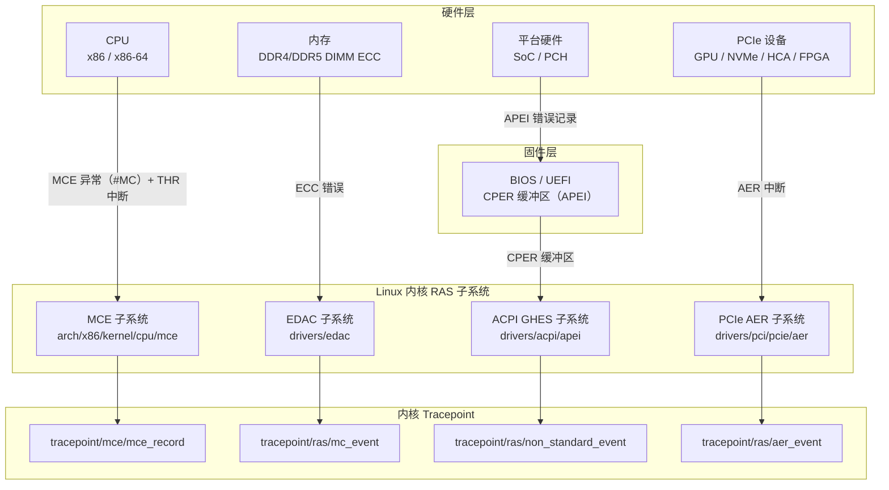

### 概述

HUATUO 华佗以零侵入、低开销的方式持续监听 Linux 内核上报的硬件错误事件，将结构化的故障记录持久化存储，并以 Prometheus 指标形式对外暴露汇总计数器，供告警与可视化系统使用。

### 应用场景

- 通用计算

    大规模服务器集群中，内存 ECC 可纠正错误（CE）是常见的低级别故障信号。单次 CE 可由硬件自动修复，但若同一 DIMM 上 CE 频率持续升高，则预示着内存条即将失效。华佗通过 EDAC/MCE tracepoint 实时感知此类事件，使工程团队能够在内存彻底失效前完成预防性换件，避免意外宕机。

- AI 计算

    AI 训练任务对硬件可靠性要求极高，单块故障的 PCIe 设备即可导致整个训练任务失败。华佗支持 PCIe AER 事件监测，能够实时上报 GPU、NVLink Bridge、RDMA 网卡（如 InfiniBand HCA）的链路层错误（Data Link Protocol Error、ECRC Error 等），为 AI 集群调度系统提供硬件健康状态数据，支撑故障节点的快速隔离与任务迁移。

- 存储服务

    存储服务器通常配备大量 PCIe NVMe SSD 和 HBA 卡。PCIe AER 中的 Completion Timeout、Malformed TLP 等错误是存储设备性能抖动或掉线的先兆。华佗监控数据可与存储 IO 延迟指标联动，支撑根因分析。

- 安全合规

    金融、政务等对合规有严格要求的行业，需要完整记录所有硬件故障历史。结构化事件存储（含时间戳、设备标识、错误类型、原始寄存器值）可直接作为硬件健康日志的合规存证。

### 监控原理

HUATUO 华佗通过 eBPF 技术观测内核的 MCE / EDAC / ACPI GHES / PCIe AER 子系统，当 eBPF tracepoint 被触发时，将原始事件写入 BPF Perf Event Buffer。用户态程序读取事件，解析结构体字段，生成结构化记录，并存储至本地或远端。总体架构如下：


### RAS 原理

Linux 内核的 RAS 体系由多个相对独立的子系统协同构成，共同覆盖从 CPU 内部错误到 PCIe 链路错误的完整硬件故障谱系。



- MCE

    MCE（Machine Check Architecture）是处理器内置的硬件容错机制，由 Intel 和 AMD 在各自的架构规范中定义。处理器内部存在若干 Bank（Machine Check Bank），每个 Bank 对应一类硬件资源（如 L1 Cache、L2 Cache、内存控制器、TLB 等）。当检测到硬件错误时，对应 Bank 的 MSR 寄存器（MCi_STATUS、MCi_ADDR、MCi_MISC）被填充错误信息，并触发 MCE 异常。

- MCE THR

    MCE 支持阈值中断机制。当某类可纠正错误的计数超过预设阈值时，触发专用 APIC 中断（THR），而不升级为完整的 MCE 异常。此机制允许操作系统在错误频率异常升高时提前告警，而非等到错误完全不可纠正时才介入。

- EDAC

    EDAC（Error Detection And Correction）是 Linux 内核中专门处理内存和硬件 ECC 错误的子系统，其目标是"检测并报告运行在 Linux 下的计算机系统中发生的硬件错误"。EDAC 驱动直接与内存控制器通信，解析 ECC 错误的物理位置（内存控制器编号、Channel、Slot、行列地址）。

- ACPI GHES

    ACPI GHES（Generic Hardware Error Source，通用硬件错误源）是一种平台无关的硬件错误上报机制，由 BIOS/UEFI 通过 APEI（ACPI Platform Error Interface）规范定义。BIOS 固件将无法被特定驱动处理的硬件错误（如特定 SoC 内部错误、平台特定内存错误）写入 GHES 描述符中的 CPER（Common Platform Error Record）缓冲区。Linux 内核读取 CPER 记录，并上报无法被标准子系统解析的"非标准"错误部分。

- PCIe AER

    PCIe AER（Advanced Error Reporting）是 PCIe 规范定义的错误上报机制，允许 PCIe 设备向操作系统精确报告链路层和事务层的错误类型。

### 指标总览

- RAS 指标

    ```bash
    # HELP huatuo_bamai_ras_hw_total total RAS hardware error events by source type
    # TYPE huatuo_bamai_ras_hw_total counter
    huatuo_bamai_ras_hw_total{host="hostname",region="dev",type="acpi"} 0
    huatuo_bamai_ras_hw_total{host="hostname",region="dev",type="aer"} 0
    huatuo_bamai_ras_hw_total{host="hostname",region="dev",type="edac"} 0
    huatuo_bamai_ras_hw_total{host="hostname",region="dev",type="mce"} 0
    huatuo_bamai_ras_hw_total{host="hostname",region="dev",type="thr"} 0
    ```

- 网卡丢包
    ```bash
    huatuo_bamai_netdev_hw_rx_dropped_total{host="hostname",region="dev",device="eth0",driver="ixgbe"} 0
    ```

- RDMA PFC
    ```bash
    # HELP huatuo_bamai_netdev_dcb_pfc_received_total count of the received pfc frames
    # TYPE huatuo_bamai_netdev_dcb_pfc_received_total counter
    huatuo_bamai_netdev_dcb_pfc_received_total{device="enp6s0f0np0",host="hostname",prio="0",region="dev"} 0
    huatuo_bamai_netdev_dcb_pfc_received_total{device="enp6s0f0np0",host="hostname",prio="1",region="dev"} 0
    huatuo_bamai_netdev_dcb_pfc_received_total{device="enp6s0f0np0",host="hostname",prio="2",region="dev"} 0
    huatuo_bamai_netdev_dcb_pfc_received_total{device="enp6s0f0np0",host="hostname",prio="3",region="dev"} 0
    huatuo_bamai_netdev_dcb_pfc_received_total{device="enp6s0f0np0",host="hostname",prio="4",region="dev"} 0
    huatuo_bamai_netdev_dcb_pfc_received_total{device="enp6s0f0np0",host="hostname",prio="5",region="dev"} 0
    huatuo_bamai_netdev_dcb_pfc_received_total{device="enp6s0f0np0",host="hostname",prio="6",region="dev"} 0
    huatuo_bamai_netdev_dcb_pfc_received_total{device="enp6s0f0np0",host="hostname",prio="7",region="dev"} 0
    # HELP huatuo_bamai_netdev_dcb_pfc_send_total count of the sent pfc frames
    # TYPE huatuo_bamai_netdev_dcb_pfc_send_total counter
    huatuo_bamai_netdev_dcb_pfc_send_total{device="enp6s0f0np0",host="hostname",prio="0",region="dev"} 0
    huatuo_bamai_netdev_dcb_pfc_send_total{device="enp6s0f0np0",host="hostname",prio="1",region="dev"} 0
    huatuo_bamai_netdev_dcb_pfc_send_total{device="enp6s0f0np0",host="hostname",prio="2",region="dev"} 0
    huatuo_bamai_netdev_dcb_pfc_send_total{device="enp6s0f0np0",host="hostname",prio="3",region="dev"} 0
    huatuo_bamai_netdev_dcb_pfc_send_total{device="enp6s0f0np0",host="hostname",prio="4",region="dev"} 0
    huatuo_bamai_netdev_dcb_pfc_send_total{device="enp6s0f0np0",host="hostname",prio="5",region="dev"} 0
    huatuo_bamai_netdev_dcb_pfc_send_total{device="enp6s0f0np0",host="hostname",prio="6",region="dev"} 0
    huatuo_bamai_netdev_dcb_pfc_send_total{device="enp6s0f0np0",host="hostname",prio="7",region="dev"} 0
    ```

- 结构化存储

    此外，每个硬件错误事件均以结构化形式持久化（存储于本地 huatuo-local 目录或远端 ES/OS 存储等），包含以下公共字段：

    ```bash
    {
        "hostname": "hostname",
        "region": "dev",
        "uploaded_time": "2026-03-05T18:28:39.153438921+08:00",
        "time": "2026-03-05 18:28:39.153 +0800",
        "tracer_name": "netdev_event",
        "tracer_time": "2026-03-05 18:28:39.153 +0800",
        "tracer_type": "auto",
        "tracer_data": {
            "ifname": "eth0",
            "index": 2,
            "linkstatus": "linkstatus_admindown",
            "mac": "5c:6f:11:11:11:11",
            "start": false
        }
    }
    ```

    linkstatus 字段的可能取值如下：
    - linkstatus_adminup 管理员开启网卡，例如 ip link set dev eth0 up
    - linkstatus_admindown 管理员关闭网卡，例如 ip link set dev eth0 down
    - linkstatus_carrierup 物理链路恢复
    - linkstatus_carrierdown 物理链路故障

    ```bash
    {
        "hostname": "localhost",
        "region": "xxx",
        "uploaded_time": "2026-05-11T16:58:47.328548319+08:00",
        "time": "2026-05-11 16:58:47.328 +0800",
        "tracer_name": "ras",
        "tracer_time": "2026-05-11 16:58:47.328 +0800",
        "tracer_type": "auto",
        "tracer_data": {
            "dev": "MEM",
            "event": "EDAC",
            "type": "Corrected",
            "timestamp": 537792166031,
            "info": "{\"err_count\":0,\"err_type\":\"Corrected\",\"err_msg\":\"memory read error\",\"label\":\"CPU_SrcID#0_Ha#0_Chan#0_DIMM#0\",\"mc_index\":0,\"top_layer\":0,\"mid_layer\":0,\"low_layer\":-1,\"addr\":7860269056,\"grain\":128,\"syndrome\":0,\"driver\":\" area:DRAM err_code:0000:009f socket:0 ha:0 channel_mask:1 rank:0\"}"
        }
    }
    ```

    | 字段名      | 含义                                                         |
    | :---------- | :----------------------------------------------------------- |
    | `Device`    | 发生错误的硬件部件标识（如 `CPU/MEM`、`MEM`、`ACPI`、`PCIe 0000:01:00.0`） |
    | `Event`     | 事件子类型（`MCE`、`EDAC`、`APIC`、`AER`） |
    | `ErrType`   | 错误严重级别（见下表）                                       |
    | `Timestamp` | 时间戳                                                       |
    | `Info`      | 具体事件的详细字段                                           |

    | 错误类型        | 含义                         | 典型来源                                              |
    | --------------- | ---------------------------- | ----------------------------------------------------- |
    | `Corrected`   | 已由硬件自动纠正，系统无感知 | MCE CE, EDAC CE, ACPI Sev=1, AER Severity=2 |
    | `UncorrectedRecoverable` | 硬件无法纠正，但系统软件可修复的错误 | MCE UE, EDAC UE, ACPI Sev=2, AER Severity=0|
    | `UncorrectedDeferred`    | 硬件无法纠正，需要延迟处理的错误| MCE MCI_STATUS_DEFERRED, EDAC HW_EVENT_ERR_DEFERRED|
    | `UncorrectedFatal`       | 硬件无法纠正的致命错误，需立即重启| EDAC FATAL, ACPI Sev=3, AER Severity=0 |
    | `Info`       | 期望系统记录日志信息的错误类型| EDAC HW_EVENT_ERR_INFO, ACPI Sev=0 |


### 详细说明

- MCE

  监控部件：CPU 核心、L1/L2/L3 Cache、TLB、内存控制器（IMC）、互连总线（QPI/UPI/Infinity Fabric）。

  | 字段名          | MSR 来源         | 含义                                                         |
  | ------------------ | ---------------- | ------------------------------------------------------------ |
  | `mcg_cpu_cap`      | `MCG_CAP` | 机器检查全局能力寄存器。低 8 位（`Count`）表示系统中 MC Bank 的数量。 |
  | `mcg_msr_status`   | `MCG_STATUS` | 机器检查全局状态寄存器**。|
  | `banks_msr_status` | `MCi_STATUS` | Bank 状态寄存器（最核心字段）。低 16 位为 MCA 错误代码（分类错误类型，如内存层次错误、总线错误等）；高位包含 `UC`（不可纠正）、`EN`（已使能）、`MISCV`（MISC 有效）、`ADDRV`（ADDR 有效）、`PCC`（处理器上下文损坏）等控制位。 |
  | `banks_msr_addr`   | `MCi_ADDR` | 发生错误的物理内存地址（仅当 `MCi_STATUS.ADDRV=1` 时有效）。可用于定位故障 DIMM 或 Cache Line。 |
  | `banks_msr_misc`   | `MCi_MISC` | 补充信息寄存器（仅当 `MCi_STATUS.MISCV=1` 时有效）。|
  | `mca_synd_msr`     | `MCA_SYND` | 综合征寄存器（AMD 专用）。 |
  | `mca_ipid_msr`     | `MCA_IPID` | 实例 ID 寄存器（AMD 专用）。 |
  | `instr_pointer`    | RIP 寄存器       | 发生 MCE 时的指令指针（仅当 `MCG_STATUS.EIPV=1` 时可靠）。   |
  | `tsc_timestamp`    | TSC              | 发生错误时的 CPU 时间戳计数器值（可与内核时钟换算为绝对时间）。 |
  | `walltime`         | 内核时间         | 发生错误时的 Unix 时间戳（秒）。                             |
  | `cpu`              | —                | 发生 MCE 的逻辑 CPU 编号。                              |
  | `cpuid`            | CPUID            | 发生 MCE 的 CPU 的 CPUID 值（包含 Family/Model/Stepping）。  |
  | `apicid`           | APIC ID          | 发生 MCE 的 CPU 对应的 APIC ID（可映射到物理核/超线程）。    |
  | `socketid`         | —                | CPU 插槽编号（Socket ID）。多路服务器场景下用于区分物理 CPU。 |
  | `code_seg`         | CS 寄存器        | 发生 MCE 时的代码段寄存器值（用于判断特权级）。              |
  | `bank`             | —                | Bank 编号（通常 Bank 0=L1I，Bank 1=L1D，Bank 2=L2，Bank 4+=内存控制器，但编号因平台而异）。 |
  | `cpuvendor`        | —                | CPU 厂商标识：`0`=Intel，`1`=未知，`2`=AMD。 |

- EDAC

  监控部件：内存 ECC 错误。

  | 字段名   | 含义                                                         |
  | ----------- | ------------------------------------------------------------ |
  | `err_count` | 本次事件中累计的错误次数。 |
  | `err_type`  | 错误严重级别。 |
  | `err_msg`   | 人类可读错误描述字符串（如 `"CE memory read error on CPU#0Channel#0_DIMM#0 (channel:0 slot:0 page:0x12345 offset:0x0 grain:8 syndrome:0x0)"`）。 |
  | `label`     | 内存条物理位置标签（如 `"CPU_SrcID#0_Ha#0_Chan#0_DIMM#0"`），由 EDAC 驱动根据 DIMM 拓扑生成，可直接对应机器内部的内存插槽位置。 |
  | `mc_index`  | 内存控制器编号（0-based）。多内存控制器服务器上用于区分不同 IMC。 |
  | `top_layer` | 内存层次结构顶层索引（通常为 Channel 编号，即内存通道号，-1 表示无效）。 |
  | `mid_layer` | 内存层次结构中层索引（通常为 Slot/Rank 编号，-1 表示无效）。 |
  | `low_layer` | 内存层次结构底层索引（通常为 Bank/Row 编号，-1 表示无效）。 |
  | `addr`      | 发生错误的物理内存地址（64-bit 无符号整数，0 表示地址无效）。 |
  | `grain`     | 错误粒度（Grain Size，字节数）。表示可能受影响的最小内存单元大小。 |
  | `syndrome`  | ECC 综合征值。 |
  | `driver`    | EDAC 驱动名称（如 `"amd64_edac"`、`"sb_edac"`）。 |

- ACPI GHES

  监控部件：平台特定硬件错误。

  | 字段名  | 含义                                                         |
  | ---------- | ------------------------------------------------------------ |
  | `severity` | ACPI/CPER 错误严重级别原始值。 |
  | `sec_type` | 错误部分类型 GUID（16 字节，十六进制字符串）。由 UEFI 规范和各硬件厂商定义，标识错误记录所属的硬件类别（如内存错误部分、PCIe 错误部分、ARM 处理器错误部分等）。 |
  | `fru_id`   | FRU（Field Replaceable Unit，现场可替换单元）标识符 GUID（16 字节，十六进制字符串）。唯一标识发生错误的可更换硬件组件（如某块内存条、某个 PCIe 卡）。 |
  | `fru_text` | FRU 人类可读描述字符串（如 `"CPU0_DIMM_A1"`）。 |
  | `data_len` | 原始错误数据载荷长度（字节数）。                         |
  | `raw_data` | 原始错误数据的十六进制转储（空格分隔字节）。用于深度诊断，需结合具体硬件厂商文档解析。 |

- PCIe AER

  监控设备包括 GPU、NVMe SSD、RDMA 网卡/HCA、FPGA 加速卡、PCIe Switch 等。

  | 字段名    | 含义                                                         |
  | ------------ | ------------------------------------------------------------ |
  | `dev_name`   | PCIe 设备名称（BDF 格式），如 `"0000:03:00.0"`，分别对应 Domain:Bus:Device.Function。 |
  | `err_type`   | 错误严重级别（`Corrected` / `Uncorrected` / `Fatal`）。      |
  | `err_reason` | 具体错误原因描述字符串，由 AER 状态寄存器的比特位解码得出（见下方两张表）。 |
  | `tlp_header` | 触发错误的 TLP（Transaction Layer Packet）头部四元组（格式：`{dword0, dword1, dword2, dword3}`，十六进制）。TLP 头部包含事务类型、地址、请求者 ID 等信息，是定位错误根因的关键数据。若 `TlpHeaderValid=0` 则显示 `"not available"`。 |

- PCIe 可纠正错误类型

  | 位掩码       | 含义                                                         |
  | ------------ | ------------------------------------------------------------ |
  | `0x00000001` | 接收端错误。物理层接收到不符合规范的数据符号，通常由信号完整性问题引起（如过长连线、阻抗不匹配）。 |
  | `0x00000040` | TLP（事务层数据包）错误。数据包的 LCRC（链路层 CRC）校验失败，表明事务层数据在传输中发生翻转，PCIe 链路层会自动重传该 TLP。 |
  | `0x00000080` | DLLP（数据链路层数据包）错误。链路层控制包（如 ACK/NAK、流控更新）CRC 校验失败。 |
  | `0x00000100` | 重传序列号溢出。`REPLAY_NUM` 字段用于追踪重传次数，该错误表明自上次 ACK 以来已发生过多次重传，通常意味着链路质量持续较差。 |
  | `0x00001000` | 重传计时器超时。发送方在规定时间内未收到 ACK，触发 TLP 重传。持续出现表明链路延迟异常或接收端处理能力不足。 |
  | `0x00002000` | 顾问性非致命错误。本质上是一个不可纠正但被软件降级为可纠正处理的错误（需启用 AER capability 中的 ANFE 功能），常见于接收到 Unsupported Request Completion 的场景。 |
  | `0x00004000` | 已纠正内部错误。设备内部 ECC 或奇偶校验错误，已由设备自主纠正。 |
  | `0x00008000` | 头部日志溢出。AER 头部日志寄存器已满，后续错误的 TLP 头部无法被记录（但错误本身仍被计数）。 |

- PCIe 不可纠正错误类型

  | 位掩码       | 含义                                                         |
  | ------------ | ------------------------------------------------------------ |
  | `0x00000001` | 未定义错误。保留位被置位，通常表明固件或硬件存在不合规行为。 |
  | `0x00000010` | 数据链路协议错误。收到了违反 DLLP 协议规范的数据包，属于严重的链路层故障。 |
  | `0x00000020` | 意外下线错误。物理链路在未经 Hot-Plug 通知的情况下突然断开（如设备意外掉电或接触不良），为热插拔场景下的高危错误。 |
  | `0x00001000` | 毒化 TLP。接收到数据有效位（EP，Error Poisoning）被主动设置为 1 的 TLP，表明上游发送方知晓该数据已损坏。此机制用于错误传播和隔离，避免静默数据损坏。 |
  | `0x00002000` | 流控协议错误。接收到违反 PCIe 流控信用（Credit）规则的数据包，属于严重的协议违规。 |
  | `0x00004000` | 完成超时。请求方（Requester）发出非 Posted 事务（如 Memory Read）后，在规定超时时间内未收到完成包（Completion）。常见于 NVMe 盘固件异常、RDMA 网卡驱动 Bug 或 PCIe 链路中断。 |
  | `0x00008000` | 完成方中止。接收端显式返回 CA（Completer Abort）状态的 Completion，表示请求被完成方拒绝。 |
  | `0x00010000` | 意外完成包。收到了无法与任何已发出的请求匹配的 Completion（Tag 不匹配），通常由设备固件 Bug 或数据路径错误引起。 |
  | `0x00020000` | 接收缓冲区溢出。接收端流控信用信息显示其缓冲区未满，但实际发生了溢出，属于严重的流控违规。 |
  | `0x00040000` | 格式错误的 TLP。数据包头部字段违反规范（如非法长度、保留字段被置位、不合法的地址范围），通常表明设备固件存在严重缺陷。 |
  | `0x00080000` | 端到端 CRC 错误。TLP 尾部的 ECRC 校验失败（需双端设备均支持 ECRC 功能），表明数据在整个传输链路（含 PCIe Switch 内部交换）中发生损坏，是高可靠性场景中的关键指标。 |
  | `0x00100000` | 不支持的请求错误。接收端返回 UR（Unsupported Request）状态，表明请求的事务类型或地址范围不被该设备支持。 |
  | `0x00200000` | ACS（Access Control Services）违规。PCIe ACS 机制用于防止 PCIe 设备之间的对等（Peer-to-Peer）DMA 绕过 IOMMU，此错误表明发生了违反 ACS 策略的数据访问，在虚拟化安全场景中需重点关注。 |
  | `0x00400000` | 不可纠正的内部错误。设备内部发生无法自行纠正的 ECC 或奇偶校验错误（如 SRAM 双比特错误），通常意味着设备硬件损坏。 |
  | `0x00800000` | 多播（MC）TLP 被阻断。PCIe 多播（Multicast）TLP 被 ACS 或 MC 控制机制阻止。 |
  | `0x01000000` | 原子操作出口被阻断。AtomicOp（原子操作请求，如 FetchAdd、Swap、CAS）因 ACS 控制被阻止出站，常见于 RDMA/GPU 直连场景。 |
  | `0x02000000` | TLP 前缀被阻断。带有 End-End TLP Prefix 的数据包被 ACS 或其他机制阻止转发。 |

### 总结

推荐在生产环境中部署华佗，实现全面的硬件错误监控与主动运维。
