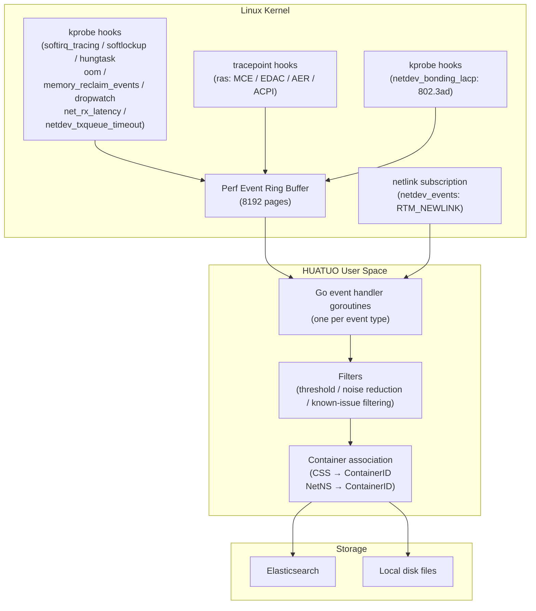
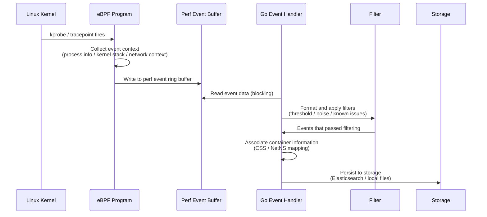

{}
<div style="text-align: center;">
HUATUO is an operating system deep observability project open-sourced by DiDi and incubated under CCF (China Computer Federation). It focuses on providing OS kernel-level deep observability for cloud-native general computing, AI computing, cloud services, and infrastructure services.
</div>
{}

## 📖 Overview

HUATUO uses eBPF technology to observe anomalous events in real time across core Linux kernel subsystems, including CPU scheduling, memory management, the network protocol stack, and hardware error reporting. When the kernel encounters anomalies such as softlockup, OOM, or hardware MCE errors, eBPF programs hook into kernel functions (kprobes) or kernel tracepoints, capturing process information, kernel call stacks, and network context at the moment the event occurs. The data is passed to user-space handlers via the perf event ring buffer and persisted to Elasticsearch or local disk files.

Compared to traditional kernel log (dmesg/syslog) collection, eBPF-based event observation reduces the risk of data loss from log buffer overflow; it can capture transient anomalies that never appear in kernel logs (such as excessive softirq disable time); and it provides container-level event correlation for precise root-cause analysis in cloud-native environments.

Eleven event types are continuously observed, covering CPU scheduling health (softirq_tracing, softlockup, hungtask), memory pressure (oom, memory_reclaim_events), the network protocol stack (dropwatch, net_rx_latency, netdev_events, netdev_bonding_lacp, netdev_txqueue_timeout), and hardware reliability (ras).

## 🎯 Use Cases

**Kubernetes Container Memory Fault Diagnosis**: In scenarios where containers frequently restart due to OOM, the oom event records both the process killed by the OOM Killer (victim) and the process that triggered the OOM (trigger), including their memcg cgroup pointers and container IDs. Combined with time-series data, this enables fast root-cause analysis of containers involved in memory contention, reducing the time spent manually reviewing container logs.

**AI Training Cluster Hardware Fault Detection**: On GPU training servers, the ras event continuously collects MCE (Machine Check Exception), EDAC memory controller errors, and PCIe AER (Advanced Error Reporting) errors, classifying them by severity (Corrected / UncorrectedRecoverable / UncorrectedFatal). This enables early detection of hardware aging or single-point failures before training jobs are interrupted, reducing training task losses caused by hardware faults.

**Network Performance Jitter Analysis**: The dropwatch event observes TCP protocol stack packet drops (including syn_flood and listen_overflow types), while net_rx_latency detects end-to-end receive-path latency for individual packets from the network card driver to user space. Separate thresholds are configured per stage (driver to kernel: 5ms, kernel to TCP: 10ms, TCP to user space: 115ms), precisely identifying which network layer causes business timeouts.

**Host Scheduling Health Observation**: The softirq_tracing (softirq disable time, default threshold 10ms), softlockup (CPU unable to schedule, ~1 second), and hungtask (D-state process hang) events jointly cover anomalies along the CPU scheduling path. When system stalls or response timeouts occur, kernel call stacks and other diagnostic data are automatically preserved, supporting offline analysis after the fault clears.

## 🚀 Usage

### Configuration

All events provide default values and are operational without any configuration. The following parameters can be tuned as needed:

| Parameter | Default | Description |
| --------- | ------- | ----------- |
| `softirq.disabled_threshold` | `10000000` (10ms, nanoseconds) | Softirq disable time trigger threshold |
| `memory_reclaim.blocked_threshold` | `900000000` (900ms, nanoseconds) | Direct memory reclaim time trigger threshold |
| `net_rx_latency.driver2net_rx` | `5` (ms) | Latency threshold from NIC driver to `__netif_receive_skb` |
| `net_rx_latency.driver2tcp` | `10` (ms) | Latency threshold from NIC driver to `tcp_v4_rcv` |
| `net_rx_latency.driver2userspace` | `115` (ms) | Latency threshold from NIC driver to user-space copy (`skb_copy_datagram_iovec`) |
| `net_rx_latency.excluded_host_netnamespace` | `true` | Whether to exclude the host network namespace (observe containers only by default) |
| `net_rx_latency.excluded_container_qos` | `[]` | List of container QoS levels to exclude |
| `dropwatch.excluded_neigh_invalidate` | `true` | Whether to filter packet drops caused by `neigh_invalidate` (neighbor table expiry noise) |
| `netdev.device_list` | `[]` | List of network device names to monitor for link state changes |
| `ras.mce_thr_backoff` | `1800` (seconds) | MCE threshold interrupt (THR) event reporting cooldown to suppress interrupt storms |
| `issues_list` | `[]` | Known-issue filter rules (applied to net_rx_latency) |

### Supported Events

| Event Name (tracer_name) | Probe Type | Trigger Condition | Typical Scenarios |
| ------------------------ | ---------- | ----------------- | ----------------- |
| `softirq_tracing` | kprobe | Softirq disable time > threshold (default 10ms) | System stalls, network latency, scheduling delays |
| `softlockup` | kprobe | CPU unable to schedule for extended time (~1 second) | Soft lockup, response anomalies |
| `hungtask` | kprobe | D-state process task hang | Transient mass D-state processes, IO blocking |
| `oom` | kprobe | OOM Killer triggered | Container/host memory exhaustion |
| `memory_reclaim_events` | kprobe | Container process direct reclaim time > threshold (default 900ms) | Business stalls caused by memory pressure |
| `ras` | tracepoint | CPU/MEM/PCIe hardware errors | Hardware fault detection |
| `dropwatch` | kprobe | TCP protocol stack packet drop | Business jitter caused by protocol stack drops |
| `net_rx_latency` | kprobe | Protocol stack receive latency exceeds per-stage threshold | Business timeouts caused by receive latency |
| `netdev_events` | netlink | NIC link state change | Physical NIC link failures |
| `netdev_bonding_lacp` | kprobe | LACP protocol state change (IEEE 802.3ad mode only) | Fault boundary between physical machines and switches |
| `netdev_txqueue_timeout` | kprobe | NIC transmit queue timeout | NIC transmit queue hardware failure |

### Fields

All event records include the following common fields:

- **hostname**: Physical machine hostname
- **region**: Availability zone where the physical machine is located
- **uploaded_time**: Data upload time
- **container_id**: Container ID if the event is associated with a container
- **container_hostname**: Container hostname if the event is associated with a container
- **container_host_namespace**: Kubernetes namespace of the container if the event is associated with a container
- **container_type**: Container type, e.g., `normal` for regular containers, `sidecar` for sidecar containers
- **container_qos**: Container QoS level
- **tracer_name**: Event name (e.g., `softirq_tracing`, `oom`)
- **tracer_id**: Tracing ID for this event
- **tracer_time**: Time when the tracing was triggered
- **tracer_type**: Trigger type — manual or automatic
- **tracer_data**: Event-specific private data (see individual event descriptions below)

### 1. softirq_tracing

**Description** Triggered when the kernel disables softirqs for longer than the configured threshold. Records the kernel call stack during the disable period and current process information to help analyze interrupt-related latency issues. The filter automatically excludes noise events from `ksoftirqd` and `swapper` processes.

**Data Storage** Event data is automatically stored in Elasticsearch or as files on the physical machine disk.

**Sample Data**

```json
{
    "uploaded_time": "2025-06-11T16:05:16.251152703+08:00",
    "hostname": "***",
    "tracer_data": {
        "offtime": 237328905,
        "threshold": 10000000,
        "comm": "***-agent",
        "pid": 688073,
        "cpu": 1,
        "now": 5532940660025295,
        "stack": "scheduler_tick/..."
    },
    "tracer_time": "2025-06-11 16:05:16.251 +0800",
    "tracer_type": "auto",
    "time": "2025-06-11 16:05:16.251 +0800",
    "region": "***",
    "tracer_name": "softirq_tracing"
}
```

**Fields**

- **comm**: Name of the process that triggered the event
- **stack**: Kernel call stack during the softirq disable period
- **now**: Monotonic clock timestamp at the time of the event (nanoseconds)
- **offtime**: Duration that softirqs were disabled (nanoseconds)
- **cpu**: CPU number where the event occurred
- **threshold**: Trigger threshold (nanoseconds); events are recorded when this is exceeded
- **pid**: Process ID that triggered the event

### 2. dropwatch

**Description** Detects packet drop behavior in the kernel network protocol stack. Outputs the kernel call stack, network 5-tuple, and TCP state at the time of the drop. Supports identifying four drop types: `common_drop`, `syn_flood`, `listen_overflow_handshake1` (SYN queue overflow), and `listen_overflow_handshake3` (accept queue overflow). The filter excludes known noisy drops including `neigh_invalidate` neighbor table expiry (configurable) and bnxt driver TX-side drops.

**Data Storage** Automatically stored in Elasticsearch or as files on the physical machine disk.

**Sample Data**

```json
{
    "tracer_data": {
        "type": "common_drop",
        "comm": "kubelet",
        "pid": 1687046,
        "saddr": "10.79.68.62",
        "daddr": "10.134.72.4",
        "sport": 8080,
        "dport": 49000,
        "src_hostname": "<nil>",
        "dest_hostname": "<nil>",
        "max_ack_backlog": 128,
        "seq": 1009085774,
        "ack_seq": 689410995,
        "pkt_len": 1460,
        "sk_state": "ESTABLISHED",
        "stack": "kfree_skb/...",
        "netdev_queue_mapping": 3,
        "netdev_linkstatus": ["linkStatusUp"],
        "netdev_name": "eth0",
        "netdev_ifindex": 2,
        "net_cookie": 123456789
    }
}
```

**Fields**

- **type**: Drop type (`common_drop` / `syn_flood` / `listen_overflow_handshake1` / `listen_overflow_handshake3`)
- **comm**: Name of the process that triggered the packet drop
- **pid**: Process ID
- **saddr / daddr**: Source IP / Destination IP address
- **sport / dport**: Source port / Destination port
- **src_hostname / dest_hostname**: Reverse DNS lookup result for source/destination IP
- **max_ack_backlog**: Maximum accept queue length of the socket
- **seq / ack_seq**: TCP sequence number / Acknowledgment sequence number
- **pkt_len**: Packet length (bytes)
- **sk_state**: TCP connection state at the time of the drop
- **stack**: Kernel call stack at the time of the drop
- **netdev_queue_mapping**: NIC queue index
- **netdev_linkstatus**: List of NIC link status flags
- **netdev_name**: Network device name
- **netdev_ifindex**: Network interface index
- **net_cookie**: Network namespace identifier

### 3. net_rx_latency

**Description** Detects latency events on the protocol stack receive path (NIC driver → kernel protocol stack → user-space receive). Three observation points are set along the receive path; when the latency of any stage exceeds the corresponding threshold (defaults: driver to kernel 5ms, kernel to TCP 10ms, TCP to user space 115ms), the event is recorded with the network 5-tuple, TCP sequence number, latency stage, and latency duration. The host network namespace is excluded by default, observing only container network traffic.

**Data Storage** Automatically stored in Elasticsearch or as files on the physical machine disk.

**Sample Data**

```json
{
    "tracer_data": {
        "comm": "nginx",
        "pid": 2921092,
        "where": "TO_USER_COPY",
        "latency_ms": 95973,
        "state": "ESTABLISHED",
        "saddr": "10.156.248.76",
        "daddr": "10.134.72.4",
        "sport": 9213,
        "dport": 49000,
        "seq": 1009085774,
        "ack_seq": 689410995,
        "pkt_len": 26064
    }
}
```

**Fields**

- **comm**: Name of the process that triggered the event
- **pid**: Process ID that triggered the event
- **saddr / daddr**: Source IP / Destination IP address
- **sport / dport**: Source port / Destination port
- **seq / ack_seq**: TCP sequence number / Acknowledgment sequence number
- **state**: TCP connection state (e.g., `ESTABLISHED`)
- **pkt_len**: Packet length (bytes)
- **where**: Stage where latency occurred (`TO_NETIF_RCV` driver-to-kernel / `TO_TCPV4_RCV` kernel-to-TCP / `TO_USER_COPY` TCP-to-user-space)
- **latency_ms**: Actual latency (milliseconds)

### 4. oom

**Description** Detects OOM (Out of Memory) events on the host or inside containers. Records information about the process killed by the OOM Killer (victim) and the process that triggered the OOM (trigger), along with the corresponding container and memory cgroup details, providing a complete fault snapshot. Host-level and per-container OOM count metrics are also maintained.

**Data Storage** Automatically stored in Elasticsearch or as files on the physical machine disk.

**Sample Data**

```json
{
    "tracer_data": {
        "trigger_memcg_css": "0xff4b8d8be3818000",
        "trigger_container_id": "***",
        "trigger_container_hostname": "***.docker",
        "trigger_pid": 3218804,
        "trigger_process_name": "java",
        "victim_memcg_css": "0xff4b8d8be3818000",
        "victim_container_id": "***",
        "victim_container_hostname": "***.docker",
        "victim_pid": 3218745,
        "victim_process_name": "java"
    }
}
```

**Fields**

- **victim_process_name / victim_pid**: Name and PID of the process killed by the OOM Killer
- **victim_container_hostname / victim_container_id**: Hostname and container ID where the killed process resided
- **victim_memcg_css**: Memory cgroup pointer (hex) of the killed process
- **trigger_process_name / trigger_pid**: Name and PID of the process that triggered OOM
- **trigger_container_hostname / trigger_container_id**: Hostname and container ID where the triggering process resided
- **trigger_memcg_css**: Memory cgroup pointer (hex) of the triggering process

### 5. softlockup

**Description** Detects softlockup events (CPU unable to be scheduled for an extended period, approximately 1 second). Provides information about the target process causing the lockup, the CPU where it occurred, and NMI backtrace information for all CPUs. A backoff strategy is applied: the reporting interval increases from 10 minutes up to a maximum of 3 hours during an event storm to prevent duplicate reports. A softlockup occurrence counter metric is also maintained.

**Data Storage** Automatically stored in Elasticsearch or as files on the physical machine disk.

**Sample Data**

```json
{
    "tracer_data": {
        "cpu": 15,
        "pid": 12345,
        "comm": "kworker/15:0",
        "cpus_stack": "2025-06-10 14:30:22 sysrq: Show backtrace of all active CPUs\nNMI backtrace for cpu 15\n..."
    }
}
```

**Fields**

- **cpu**: CPU number where the softlockup occurred
- **pid**: PID of the process that triggered the softlockup
- **comm**: Name of the process that triggered the softlockup
- **cpus_stack**: NMI backtrace for all CPUs (multi-line text containing timestamps and call stacks)

### 6. hungtask

**Description** Detects hungtask events. Captures the kernel stacks of all processes in D state (uninterruptible sleep) and NMI backtrace for all CPUs to preserve the fault scene. A backoff strategy is applied: the reporting interval increases from 10 minutes up to a maximum of 3 hours during an event storm. A hungtask occurrence counter metric is also maintained. Note: some Linux distributions (e.g., Fedora 42) disable hungtask detection by default, in which case this observer will not start.

**Data Storage** Automatically stored in Elasticsearch or as files on the physical machine disk.

**Sample Data**

```json
{
    "tracer_data": {
        "pid": 2567042,
        "comm": "kworker/u48:2",
        "cpus_stack": "2025-06-10 09:57:14 sysrq: Show backtrace of all active CPUs\nNMI backtrace for cpu 33\n...",
        "blocked_processes_stack": "task:java            state:D stack:    0 pid: 12345 ..."
    }
}
```

**Fields**

- **pid**: PID of the process that triggered the hungtask detection
- **comm**: Name of the process that triggered the hungtask detection
- **cpus_stack**: NMI backtrace for all CPUs (multi-line text containing timestamps and call stacks)
- **blocked_processes_stack**: Kernel stack information of D-state processes

### 7. memory_reclaim_events

**Description** Detects direct memory reclaim events for container processes. Triggered when the direct reclaim time of the same process within 1 second exceeds the configured threshold (default 900ms). Records the reclaim duration, process, and container information. **Note: this observer only records events for container processes; host process events are filtered out.**

**Data Storage** Automatically stored in Elasticsearch or as files on the physical machine disk.

**Sample Data**

```json
{
    "tracer_data": {
        "pid": 1896137,
        "comm": "java",
        "deltatime": 1412702917
    }
}
```

**Fields**

- **comm**: Name of the process that triggered direct memory reclaim
- **pid**: PID of the triggering process
- **deltatime**: Direct reclaim duration (nanoseconds)

### 8. ras

**Description** Detects hardware errors from CPU, memory, and PCIe subsystems via kernel tracepoints. Supports five hardware error sources: MCE (Machine Check Exception), EDAC (memory controller), ACPI/GHES (non-standard hardware errors), PCIe AER (Advanced Error Reporting), and MCE threshold interrupts (THR). Errors are classified by severity: `Corrected`, `UncorrectedRecoverable`, `UncorrectedDeferred`, and `UncorrectedFatal`. MCE threshold interrupt events use a cooldown period (default 30 minutes) to suppress interrupt storm-driven duplicate reports.

**Data Storage** Automatically stored in Elasticsearch or as files on the physical machine disk.

**MCE Sample Data**

```json
{
    "tracer_data": {
        "dev": "CPU/MEM",
        "event": "MCE",
        "type": "UncorrectedRecoverable",
        "timestamp": 1749600000000000000,
        "info": "{\"mcg_cpu_cap\":4096,\"banks_msr_status\":9295429630892703744,\"cpu\":2,\"socketid\":0,\"bank\":5}"
    }
}
```

**PCIe AER Sample Data**

```json
{
    "tracer_data": {
        "dev": "PCIe 0000:3b:00.0",
        "event": "AER",
        "type": "UncorrectedRecoverable",
        "timestamp": 1749600000000000000,
        "info": "{\"dev_name\":\"0000:3b:00.0\",\"err_type\":\"UncorrectedRecoverable\",\"err_reason\":\"Completion Timeout\",\"tlp_header\":\"not available\"}"
    }
}
```

**Fields**

- **dev**: Hardware device where the error occurred (e.g., `CPU/MEM`, `PCIe 0000:3b:00.0`)
- **event**: Error type (`MCE` / `EDAC` / `NON_STANDARD` / `AER` / `MCE_THRESHOLD`)
- **type**: Error severity (`Corrected` / `UncorrectedRecoverable` / `UncorrectedDeferred` / `UncorrectedFatal` / `Info`)
- **timestamp**: Timestamp when the hardware error occurred
- **info**: JSON-formatted detailed error information; content varies by event type

### 9. netdev_events

**Description** Detects NIC link state change events by subscribing to kernel netlink RTM_NEWLINK messages. Captures events including down/up transitions, MTU changes, AdminDown, and CarrierDown, along with interface name, link status, MAC address, and driver information. At startup, the observer scans the current state of all devices in `device_list` as a baseline; only state changes are reported thereafter.

**Data Storage** Automatically stored in Elasticsearch or as files on the physical machine disk.

**Sample Data**

```json
{
    "tracer_data": {
        "ifname": "eth1",
        "index": 3,
        "linkstatus": "linkStatusAdminDown, linkStatusCarrierDown",
        "mac": "5c:6f:69:34:dc:72",
        "start": false,
        "driver": "ixgbe",
        "driver_version": "5.1.0-k",
        "firmware_version": "3.25 0x80000421 1.2163.0"
    }
}
```

**Fields**

- **ifname**: Network interface name (e.g., `eth1`)
- **index**: Interface index number
- **linkstatus**: Link state change description (may contain multiple states)
- **mac**: NIC MAC address
- **start**: Whether this is a baseline event scanned at startup (`true`: startup scan, `false`: real-time change event)
- **driver**: NIC driver name
- **driver_version**: NIC driver version
- **firmware_version**: NIC firmware version

### 10. netdev_bonding_lacp

**Description** Detects LACP (Link Aggregation Control Protocol, IEEE 802.3ad) protocol state changes in bonding mode. Reads and records the complete status of all bonding interfaces under `/proc/net/bonding/`, including mode, MII status, Actor/Partner negotiation parameters, and slave link states. **This observer is only activated automatically when an IEEE 802.3ad bonding interface is present on the system.**

**Data Storage** Automatically stored in Elasticsearch or as files on the physical machine disk.

**Sample Data**

```json
{
    "tracer_data": {
        "content": "/proc/net/bonding/bond0\nEthernet Channel Bonding Driver: v4.18.0...\nBonding Mode: IEEE 802.3ad Dynamic link aggregation\nMII Status: down\n..."
    }
}
```

**Fields**

- **content**: Complete bonding interface status information (multi-line text containing LACP negotiation details for all slaves, equivalent to the `/proc/net/bonding/bondX` file content)

### 11. netdev_txqueue_timeout

**Description** Detects NIC transmit queue timeout (TX queue timeout) events. Records the queue index, device name, and driver name where the timeout occurred, used to identify hardware failures on the NIC transmit path.

**Data Storage** Automatically stored in Elasticsearch or as files on the physical machine disk.

**Sample Data**

```json
{
    "tracer_data": {
        "queue_index": 3,
        "device_name": "eth0",
        "driver_name": "ixgbe"
    }
}
```

**Fields**

- **queue_index**: Index of the transmit queue where the timeout occurred
- **device_name**: Network device name
- **driver_name**: NIC driver name

## ⚙️ How It Works

### Architecture

HUATUO's anomalous event observation is built on eBPF technology. Event data is collected in kernel space with minimal performance overhead, and processed by user-space daemons for formatting, filtering, container association, and persistent storage.



### Event Processing Flow



{}
<div style="text-align: center;">
🌟 Star us: <a href="https://github.com/ccfos/huatuo" target="_blank">https://github.com/ccfos/huatuo</a>
<br><br>
👀 Follow our official WeChat account<br>

</div>
{}
