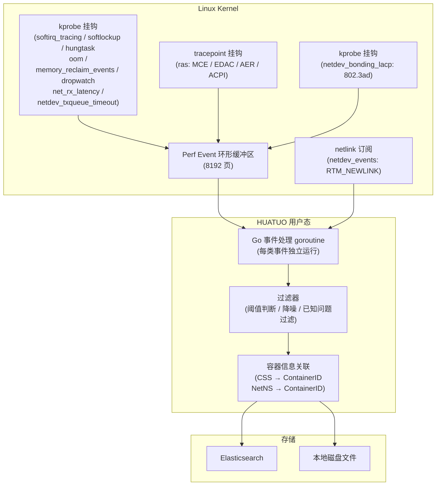
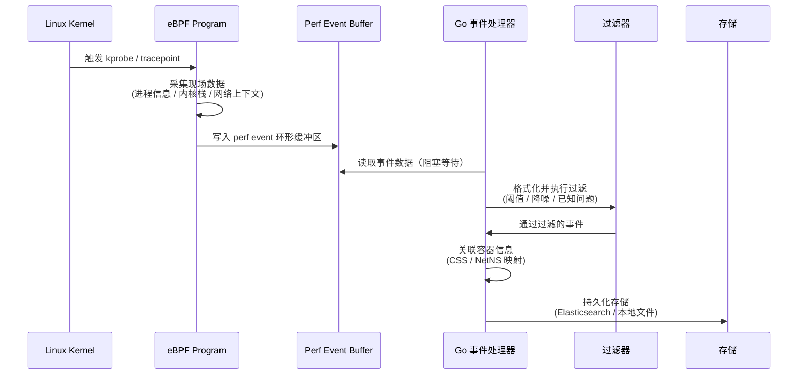

{}
<div style="text-align: center;">
HUATUO（华佗）是由滴滴开源并依托 CCF（中国计算机学会）孵化的操作系统深度观测项目，专注为云原生通用计算、AI 计算、云服务、基础服务等提供操作系统内核级深度观测能力。
</div>
{}

## 📖 概述

HUATUO 基于 eBPF 技术，对 Linux 内核中的 CPU 调度、内存子系统、网络协议栈、硬件错误等核心子系统实施实时异常事件观测。当内核触发 softlockup、OOM、硬件 MCE 等异常状态时，eBPF 程序通过挂钩（hook）内核函数（kprobe）或内核 tracepoint，在事件发生的第一时间采集进程信息、内核调用栈、网络上下文等现场数据，并经由 perf event 环形缓冲区传递至用户态处理程序，最终持久化至 Elasticsearch 或本地磁盘文件。

相比传统的基于内核日志（dmesg/syslog）采集方案，eBPF 事件观测具备更低的数据丢失风险——不会因内核日志缓冲区满溢而丢失关键事件；同时可捕获不会写入内核日志的短暂性异常（如软中断关闭时间过长）；并提供容器级别的事件关联信息，满足云原生场景下的精准定位需求。

当前支持 11 类事件的持续观测，覆盖 CPU 调度健康状态（softirq_tracing、softlockup、hungtask）、内存压力（oom、memory_reclaim_events）、网络协议栈（dropwatch、net_rx_latency、netdev_events、netdev_bonding_lacp、netdev_txqueue_timeout）以及硬件可靠性（ras）等方面。

## 🎯 场景

**Kubernetes 容器内存故障定位**：在容器频繁 OOM 重启场景下，oom 事件同时记录被 OOM Killer 终止的进程（victim）与触发 OOM 的进程（trigger）的 memcg cgroup 指针及容器 ID，结合时序数据可快速定位内存资源争抢的根因容器，降低人工排查容器日志的时间成本。

**AI 训练集群硬件故障感知**：在 GPU 训练服务器上，ras 事件持续采集 MCE（Machine Check Exception）、EDAC 内存控制器错误和 PCIe AER（Advanced Error Reporting）错误，对错误进行严重程度分级（Corrected / UncorrectedRecoverable / UncorrectedFatal），在训练任务中断前提前感知硬件老化或单点故障，减少因硬件故障导致的训练任务损失。

**网络性能毛刺分析**：dropwatch 观测 TCP 协议栈丢包行为（含 syn_flood、listen_overflow 等类型），net_rx_latency 检测单个数据包从网卡驱动到用户态的完整接收路径延迟，按阶段（网卡到内核、内核到 TCP、TCP 到用户态）分别设置阈值（默认 5ms / 10ms / 115ms），精准定位造成业务超时的网络层位置，提升网络问题根因定位效率。

**主机调度健康观测**：softirq_tracing（软中断关闭时间，默认阈值 10ms）、softlockup（CPU 无法调度，约 1 秒）、hungtask（D 状态进程任务挂起）三类事件联合覆盖 CPU 调度路径的异常状态，当系统出现卡顿、响应超时等现象时，自动保留内核调用栈等诊断信息，支持在故障消失后的离线分析。

## 🚀 使用

### 配置参数

各事件可通过以下参数进行调优，参数均提供默认值，无需配置即可运行：

| 参数 | 默认值 | 说明 |
| ---- | ------ | ---- |
| `softirq.disabled_threshold` | `10000000`（10ms，纳秒） | 软中断关闭时间触发阈值 |
| `memory_reclaim.blocked_threshold` | `900000000`（900ms，纳秒） | 直接内存回收时间触发阈值 |
| `net_rx_latency.driver2net_rx` | `5`（ms） | 从网卡驱动到 `__netif_receive_skb` 的延迟阈值 |
| `net_rx_latency.driver2tcp` | `10`（ms） | 从网卡驱动到 `tcp_v4_rcv` 的延迟阈值 |
| `net_rx_latency.driver2userspace` | `115`（ms） | 从网卡驱动到用户态拷贝（`skb_copy_datagram_iovec`）的延迟阈值 |
| `net_rx_latency.excluded_host_netnamespace` | `true` | 是否过滤宿主机网络命名空间（默认仅观测容器） |
| `net_rx_latency.excluded_container_qos` | `[]` | 需要排除的容器 QoS 级别列表 |
| `dropwatch.excluded_neigh_invalidate` | `true` | 是否过滤 `neigh_invalidate` 引起的邻居表丢包噪声 |
| `netdev.device_list` | `[]` | 需要监控链路状态的网卡设备名称列表 |
| `ras.mce_thr_backoff` | `1800`（秒） | MCE 阈值中断（THR）事件上报冷却时间，防止中断风暴 |
| `issues_list` | `[]` | 已知问题过滤规则列表（用于 net_rx_latency） |

### 事件列表

| 事件名称（tracer_name） | 探针类型 | 触发条件 | 典型场景 |
| ----------------------- | -------- | -------- | -------- |
| `softirq_tracing` | kprobe | 软中断关闭时间 > 阈值（默认 10ms） | 系统卡顿、网络延迟、调度延迟 |
| `softlockup` | kprobe | CPU 长时间无法调度（约 1 秒） | 系统软锁死、响应异常 |
| `hungtask` | kprobe | D 状态进程任务挂起 | 瞬时批量 D 进程、IO 阻塞 |
| `oom` | kprobe | OOM Killer 触发 | 容器/宿主机内存耗尽 |
| `memory_reclaim_events` | kprobe | 容器进程直接回收时间 > 阈值（默认 900ms） | 内存压力导致业务卡顿 |
| `ras` | tracepoint | CPU/MEM/PCIe 硬件错误 | 硬件故障感知 |
| `dropwatch` | kprobe | TCP 协议栈丢包 | 协议栈丢包导致业务毛刺 |
| `net_rx_latency` | kprobe | 协议栈接收延迟超分段阈值 | 接收延迟引起业务超时 |
| `netdev_events` | netlink | 网卡链路状态变化 | 网卡物理链路故障 |
| `netdev_bonding_lacp` | kprobe | LACP 协议状态变化（仅 802.3ad 模式环境） | 物理机与交换机故障边界界定 |
| `netdev_txqueue_timeout` | kprobe | 网卡发送队列超时 | 网卡发送队列硬件故障 |

### 通用字段说明

所有事件数据均包含以下通用字段：

- **hostname**：物理机 hostname
- **region**：物理机所在可用区
- **uploaded_time**：数据上传时间
- **container_id**：如果事件关联容器，则记录的容器 ID
- **container_hostname**：如果事件关联容器，则记录的容器 hostname
- **container_host_namespace**：如果事件关联容器，则记录容器的 K8s 命名空间
- **container_type**：容器类型，例如 `normal` 普通容器，`sidecar` 边车容器等
- **container_qos**：容器 QoS 级别
- **tracer_name**：事件名称（如 `softirq_tracing`、`oom` 等）
- **tracer_id**：此次的 tracing ID
- **tracer_time**：触发 tracing 时间
- **tracer_type**：触发类型（手动触发或自动触发）
- **tracer_data**：特定事件私有数据（详见各事件说明）

### 1. softirq_tracing 软中断关闭

**功能描述** 检测内核关闭软中断时间过长时触发，记录关闭软中断期间的内核调用栈、当前进程信息等关键数据，帮助分析中断相关延迟问题。过滤器自动排除 `ksoftirqd` 和 `swapper` 进程产生的噪声事件。

**数据存储** 事件数据自动存储至 Elasticsearch 或物理机磁盘文件。

**示例数据**

```json
{
    "uploaded_time": "2025-06-11T16:05:16.251152703+08:00",
    "hostname": "***",
    "tracer_data": {
        "offtime": 237328905,
        "threshold": 10000000,
        "comm": "***-agent",
        "pid": 688073,
        "cpu": 1,
        "now": 5532940660025295,
        "stack": "scheduler_tick/..."
    },
    "tracer_time": "2025-06-11 16:05:16.251 +0800",
    "tracer_type": "auto",
    "time": "2025-06-11 16:05:16.251 +0800",
    "region": "***",
    "tracer_name": "softirq_tracing"
}
```

**字段含义解释**

- **comm**：触发事件的进程名称
- **stack**：关闭软中断期间的内核调用栈
- **now**：事件发生时的单调时钟时间戳（纳秒）
- **offtime**：软中断关闭的持续时间（纳秒）
- **cpu**：发生事件的 CPU 编号
- **threshold**：触发阈值（纳秒），超过该值则记录事件
- **pid**：触发事件的进程 ID

### 2. dropwatch 协议栈丢包

**功能描述** 检测内核网络协议栈中的丢包行为，输出丢包时的内核调用栈、网络五元组、TCP 状态等信息。支持识别 4 种丢包类型：`common_drop`（通用丢包）、`syn_flood`（SYN 洪泛）、`listen_overflow_handshake1`（半连接队列溢出）、`listen_overflow_handshake3`（全连接队列溢出）。过滤器默认排除 `neigh_invalidate` 邻居表过期丢包和 bnxt 驱动发送侧丢包等已知噪声。

**数据存储** 自动存储至 Elasticsearch 或物理机磁盘文件。

**示例数据**

```json
{
    "tracer_data": {
        "type": "common_drop",
        "comm": "kubelet",
        "pid": 1687046,
        "saddr": "10.79.68.62",
        "daddr": "10.134.72.4",
        "sport": 8080,
        "dport": 49000,
        "src_hostname": "<nil>",
        "dest_hostname": "<nil>",
        "max_ack_backlog": 128,
        "seq": 1009085774,
        "ack_seq": 689410995,
        "pkt_len": 1460,
        "sk_state": "ESTABLISHED",
        "stack": "kfree_skb/...",
        "netdev_queue_mapping": 3,
        "netdev_linkstatus": ["linkStatusUp"],
        "netdev_name": "eth0",
        "netdev_ifindex": 2,
        "net_cookie": 123456789
    }
}
```

**字段含义解释**

- **type**：丢包类型（`common_drop` / `syn_flood` / `listen_overflow_handshake1` / `listen_overflow_handshake3`）
- **comm**：触发丢包的进程名称
- **pid**：进程 ID
- **saddr / daddr**：源 IP / 目的 IP 地址
- **sport / dport**：源端口 / 目的端口
- **src_hostname / dest_hostname**：源/目的 IP 的反向 DNS 解析结果
- **max_ack_backlog**：socket 最大 accept 队列长度
- **seq / ack_seq**：TCP 序列号 / 确认序列号
- **pkt_len**：数据包长度（字节）
- **sk_state**：丢包时 TCP 连接状态
- **stack**：丢包发生时的内核调用栈
- **netdev_queue_mapping**：网卡队列索引
- **netdev_linkstatus**：网卡链路状态标志列表
- **netdev_name**：网卡设备名称
- **netdev_ifindex**：网卡接口索引
- **net_cookie**：网络命名空间标识符

### 3. net_rx_latency 协议栈延迟

**功能描述** 检测协议栈接收方向（网卡驱动 → 内核协议栈 → 用户态主动收包）的分段延迟事件。在接收路径上设置三个观测点，任意阶段延迟超过对应阈值（默认：网卡到内核 5ms、内核到 TCP 10ms、TCP 到用户态 115ms）时触发，记录网络五元组、TCP 序列号、延迟位置及延迟时间。默认过滤宿主机网络命名空间，仅观测容器网络。

**数据存储** 自动存储至 Elasticsearch 或物理机磁盘文件。

**示例数据**

```json
{
    "tracer_data": {
        "comm": "nginx",
        "pid": 2921092,
        "where": "TO_USER_COPY",
        "latency_ms": 95973,
        "state": "ESTABLISHED",
        "saddr": "10.156.248.76",
        "daddr": "10.134.72.4",
        "sport": 9213,
        "dport": 49000,
        "seq": 1009085774,
        "ack_seq": 689410995,
        "pkt_len": 26064
    }
}
```

**字段含义解释**

- **comm**：触发事件的进程名称
- **pid**：触发事件的进程 ID
- **saddr / daddr**：源 IP / 目的 IP 地址
- **sport / dport**：源端口 / 目的端口
- **seq / ack_seq**：TCP 序列号 / 确认序列号
- **state**：TCP 连接状态（如 `ESTABLISHED`）
- **pkt_len**：数据包长度（字节）
- **where**：延迟发生的阶段（`TO_NETIF_RCV` 网卡到内核 / `TO_TCPV4_RCV` 内核到 TCP / `TO_USER_COPY` TCP 到用户态）
- **latency_ms**：实际延迟时间（毫秒）

### 4. oom 内存耗尽

**功能描述** 检测宿主机或容器内发生的 OOM（Out of Memory）事件，记录被 OOM Killer 终止的进程（victim）与触发 OOM 的进程（trigger）信息，以及对应容器和 memory cgroup 的详细信息，提供完整的故障快照。同时维护宿主机和各容器的 OOM 计数指标。

**数据存储** 自动存储至 Elasticsearch 或物理机磁盘文件。

**示例数据**

```json
{
    "tracer_data": {
        "trigger_memcg_css": "0xff4b8d8be3818000",
        "trigger_container_id": "***",
        "trigger_container_hostname": "***.docker",
        "trigger_pid": 3218804,
        "trigger_process_name": "java",
        "victim_memcg_css": "0xff4b8d8be3818000",
        "victim_container_id": "***",
        "victim_container_hostname": "***.docker",
        "victim_pid": 3218745,
        "victim_process_name": "java"
    }
}
```

**字段含义解释**

- **victim_process_name / victim_pid**：被 OOM Killer 终止的进程名称与 PID
- **victim_container_hostname / victim_container_id**：被终止进程所在的容器主机名与容器 ID
- **victim_memcg_css**：被终止进程对应的 memory cgroup 指针（十六进制）
- **trigger_process_name / trigger_pid**：触发 OOM 的进程名称与 PID
- **trigger_container_hostname / trigger_container_id**：触发进程所在的容器主机名与容器 ID
- **trigger_memcg_css**：触发进程对应的 memory cgroup 指针（十六进制）

### 5. softlockup 软锁死

**功能描述** 检测系统 softlockup 事件（CPU 长时间无法被调度，约 1 秒），提供导致锁死的目标进程信息、所在 CPU 及所有 CPU 的 NMI 回溯信息。采用退避（backoff）策略，同一轮事件风暴期间上报间隔从 10 分钟递增至最长 3 小时，防止重复上报。同时维护 softlockup 发生次数的计数指标。

**数据存储** 自动存储至 Elasticsearch 或物理机磁盘文件。

**示例数据**

```json
{
    "tracer_data": {
        "cpu": 15,
        "pid": 12345,
        "comm": "kworker/15:0",
        "cpus_stack": "2025-06-10 14:30:22 sysrq: Show backtrace of all active CPUs\nNMI backtrace for cpu 15\n..."
    }
}
```

**字段含义解释**

- **cpu**：发生 softlockup 的 CPU 编号
- **pid**：触发 softlockup 的进程 PID
- **comm**：触发 softlockup 的进程名称
- **cpus_stack**：所有 CPU 的 NMI 回溯信息（多行文本，包含时间戳和调用栈）

### 6. hungtask 任务挂起

**功能描述** 检测系统 hungtask 事件，捕获当前所有处于 D 状态（不可中断睡眠）的进程内核栈及所有 CPU 的回溯信息，用于保留故障现场。采用退避策略，同一轮事件风暴期间上报间隔从 10 分钟递增至最长 3 小时。同时维护 hungtask 发生次数的计数指标。注意：部分 Linux 发行版（如 Fedora 42）默认禁用 hungtask 检测，此时该观测器不会启动。

**数据存储** 自动存储至 Elasticsearch 或物理机磁盘文件。

**示例数据**

```json
{
    "tracer_data": {
        "pid": 2567042,
        "comm": "kworker/u48:2",
        "cpus_stack": "2025-06-10 09:57:14 sysrq: Show backtrace of all active CPUs\nNMI backtrace for cpu 33\n...",
        "blocked_processes_stack": "task:java            state:D stack:    0 pid: 12345 ..."
    }
}
```

**字段含义解释**

- **pid**：触发 hungtask 检测的进程 PID
- **comm**：触发 hungtask 检测的进程名称
- **cpus_stack**：所有 CPU 的 NMI 回溯信息（多行文本，包含时间戳和调用栈）
- **blocked_processes_stack**：D 状态进程的内核栈信息

### 7. memory_reclaim_events 内存回收

**功能描述** 检测容器进程发生直接内存回收（direct reclaim）的事件，当同一进程在 1 秒内直接回收时间超过阈值（默认 900ms）时触发，记录回收耗时、进程及容器信息。**注意：该观测器仅记录容器进程的内存回收事件，宿主机进程的事件会被过滤。**

**数据存储** 自动存储至 Elasticsearch 或物理机磁盘文件。

**示例数据**

```json
{
    "tracer_data": {
        "pid": 1896137,
        "comm": "java",
        "deltatime": 1412702917
    }
}
```

**字段含义解释**

- **comm**：触发直接内存回收的进程名称
- **pid**：触发进程的 PID
- **deltatime**：直接回收耗时（纳秒）

### 8. ras 硬件错误

**功能描述** 通过内核 tracepoint 检测 CPU、内存、PCIe 等硬件错误，支持 5 种硬件错误来源：MCE（Machine Check Exception）、EDAC（内存控制器）、ACPI/GHES（非标准硬件错误）、PCIe AER（高级错误上报）、MCE 阈值中断（THR）。错误按严重程度分级：`Corrected`（已纠正）、`UncorrectedRecoverable`（未纠正可恢复）、`UncorrectedFatal`（未纠正致命）。MCE 阈值中断事件采用冷却策略（默认 30 分钟），防止中断风暴触发大量重复上报。

**数据存储** 自动存储至 Elasticsearch 或物理机磁盘文件。

**MCE 示例数据**

```json
{
    "tracer_data": {
        "dev": "CPU/MEM",
        "event": "MCE",
        "type": "UncorrectedRecoverable",
        "timestamp": 1749600000000000000,
        "info": "{\"mcg_cpu_cap\":4096,\"banks_msr_status\":9295429630892703744,\"cpu\":2,\"socketid\":0,\"bank\":5}"
    }
}
```

**PCIe AER 示例数据**

```json
{
    "tracer_data": {
        "dev": "PCIe 0000:3b:00.0",
        "event": "AER",
        "type": "UncorrectedRecoverable",
        "timestamp": 1749600000000000000,
        "info": "{\"dev_name\":\"0000:3b:00.0\",\"err_type\":\"UncorrectedRecoverable\",\"err_reason\":\"Completion Timeout\",\"tlp_header\":\"not available\"}"
    }
}
```

**字段含义解释**

- **dev**：发生错误的硬件设备（如 `CPU/MEM`、`PCIe 0000:3b:00.0`）
- **event**：错误类型（`MCE` / `EDAC` / `NON_STANDARD` / `AER` / `MCE_THRESHOLD`）
- **type**：错误严重程度（`Corrected` / `UncorrectedRecoverable` / `UncorrectedDeferred` / `UncorrectedFatal` / `Info`）
- **timestamp**：硬件错误发生时的时间戳
- **info**：JSON 格式的详细错误信息，内容因 event 类型不同而不同

### 9. netdev_events 网络设备

**功能描述** 通过订阅内核 netlink RTM_NEWLINK 消息，检测网卡链路状态变化事件（down/up、MTU 变更、AdminDown、CarrierDown 等），输出接口名称、链路状态、MAC 地址及驱动信息。观测器启动时会扫描 `device_list` 中配置的网卡当前状态作为基线，后续仅上报状态变化事件。

**数据存储** 自动存储至 Elasticsearch 或物理机磁盘文件。

**示例数据**

```json
{
    "tracer_data": {
        "ifname": "eth1",
        "index": 3,
        "linkstatus": "linkStatusAdminDown, linkStatusCarrierDown",
        "mac": "5c:6f:69:34:dc:72",
        "start": false,
        "driver": "ixgbe",
        "driver_version": "5.1.0-k",
        "firmware_version": "3.25 0x80000421 1.2163.0"
    }
}
```

**字段含义解释**

- **ifname**：网络接口名称（如 `eth1`）
- **index**：接口索引号
- **linkstatus**：链路状态变化描述（可包含多个状态）
- **mac**：网卡 MAC 地址
- **start**：是否为启动时扫描的基线事件（`true`：启动扫描，`false`：实时变化事件）
- **driver**：网卡驱动名称
- **driver_version**：网卡驱动版本
- **firmware_version**：网卡固件版本

### 10. netdev_bonding_lacp LACP 协议

**功能描述** 检测 bonding 模式下 LACP（Link Aggregation Control Protocol，IEEE 802.3ad）协议的状态变化，读取并记录 `/proc/net/bonding/` 下所有 bonding 接口的完整状态信息，包含模式、MII 状态、Actor/Partner 协商参数、Slave 链路状态等。**仅在系统存在 IEEE 802.3ad bonding 模式接口时自动启用。**

**数据存储** 自动存储至 Elasticsearch 或物理机磁盘文件。

**示例数据**

```json
{
    "tracer_data": {
        "content": "/proc/net/bonding/bond0\nEthernet Channel Bonding Driver: v4.18.0...\nBonding Mode: IEEE 802.3ad Dynamic link aggregation\nMII Status: down\n..."
    }
}
```

**字段含义解释**

- **content**：完整的 bonding 接口状态信息（多行文本，包含所有 Slave 的 LACP 协商细节，等同于 `/proc/net/bonding/bondX` 文件内容）

### 11. netdev_txqueue_timeout 发送队列超时

**功能描述** 检测网卡发送队列超时（TX queue timeout）事件，记录发生超时的队列索引、设备名称和驱动名称，用于定位网卡发送方向的硬件故障。

**数据存储** 自动存储至 Elasticsearch 或物理机磁盘文件。

**示例数据**

```json
{
    "tracer_data": {
        "queue_index": 3,
        "device_name": "eth0",
        "driver_name": "ixgbe"
    }
}
```

**字段含义解释**

- **queue_index**：发生超时的发送队列索引
- **device_name**：网卡设备名称
- **driver_name**：网卡驱动名称

## ⚙️ 原理

### 整体架构

HUATUO 的异常事件观测基于 eBPF 技术，在内核态以极低的性能损耗采集异常事件现场数据，并通过用户态守护进程完成格式化、过滤、容器信息关联和持久化存储。



### 事件处理流程



{}
<div style="text-align: center;">
🌟 欢迎 Star: <a href="https://github.com/ccfos/huatuo" target="_blank">https://github.com/ccfos/huatuo</a>
<br><br>
👀 欢迎订阅官方微信公众号<br>

</div>
{}
